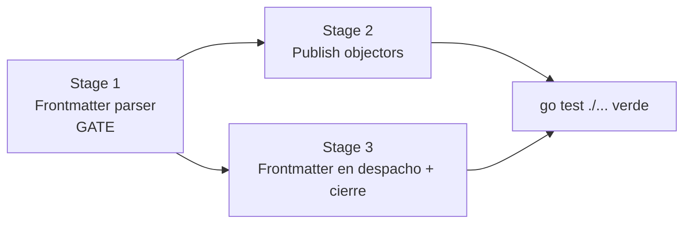

# Opositores a la publicación + cabecera (frontmatter) del PLAN.md

> This plan is dispatched via the CodeJob workflow. See skill: agents-workflow.
> How to write a `PLAN.md` body: see skill plan-authoring.
>
> Documento en español a pedido del mantenedor. El contrato (tests) va en inglés.

## Anti-footgun para el agente ejecutor (LEER PRIMERO)

- **`devflow` es tooling de backend/CLI.** Usa la stdlib de Go legítimamente
  (`os`, `strings`, `errors`, `fmt`, `path/filepath`). **NO** apliques las reglas
  WASM del ecosistema tinywasm (nada de `tinywasm/fmt`, `tinywasm/strings`, etc.)
  aquí. No "corrijas" imports de stdlib.
- Los archivos `codejob` y `gopush` en la raíz del repo son **binarios ELF
  compilados** (artefactos), no código fuente. **No los toques.**
- **No** menciones ni invokes `codejob`/`gopush` dentro del código o los tests:
  son herramientas locales del desarrollador. El cierre de loop lo hace el
  desarrollador, no el agente.
- Este plan es **TDD estricto**: primero escribe/ajusta los tests del contrato
  (§0), corren en rojo, y luego implementas hasta que pasen **sin relajar sus
  expectativas**. Agregar tests nuevos sí está permitido.

---

## 0. Contrato TDD — archivos de test que fijan el comportamiento

> **Regla:** NO crear archivos de test nuevos. Cada contrato se agrega al archivo
> de test del manager/dominio dueño, que YA existe. Extender, no inventar.

| Archivo (EXISTENTE, extender) | Contrato que fija |
|---|---|
| `test/markdown_extractor_test.go` | `ParseFrontmatter` / `MarkDown.Frontmatter()` (junto a los tests de `Extract`, mismo tipo `MarkDown`): parseo, casos de error verbatim, comillas, claves desconocidas ignoradas, CRLF, líneas en blanco. |
| `test/gomod_handler_test.go` | `GoModHandler.ObjectsToPublish` → `Skip` cuando hay otros `replace` (reusa `HasOtherReplaces`). |
| `test/codejob_test.go` | `CodeJob.ObjectsToPublish` → `Skip` (sesión) / `DepsOnly` (`docs/PLAN.md`) / `None`. **Y** `CodeJob.Send` rechaza frontmatter inválido antes de despachar (ver §Stage 3a: **actualizar** los `TestCodeJob_Send_*`/`TestCodeJob_Run_NoArgs_Dispatch` existentes, que hoy usan planes sin frontmatter). |
| `test/dependents_guard_test.go` | `resolvePublishAction` (precedencia `Skip > DepsOnly > None`, cadena nil → `None`), `Git.ObjectsToPublish` (reusa `WorkTreeDirtyBeyond`, ya testeado aquí), y `UpdateDependentModule` según acción: `Skip` → sin commit; `DepsOnly` → `CommitPaths("go.mod","go.sum")` sin tag ni cascada; `None` → `Push` completo. Reusa el mock `GitClient` existente. |
| `test/codejob_state_test.go` | `resolvePublishMessage`: mensaje CLI gana; si vacío usa frontmatter; si ambos vacíos → error verbatim. `ReadPlanMeta` sobre archivo temporal. (Junto a los `TestMergeAndPublish_*` ya existentes.) |

**Impacto en tests existentes (obligatorio corregirlos, no duplicar):**
- `TestCodeJob_Run_NoArgs_Dispatch`, `TestCodeJob_Send_PublishesBeforeDispatch`,
  `TestCodeJob_Send_PublishSilently` escriben planes **sin frontmatter**
  (`"some plan"`). Con el gate del Stage 3a **fallarían**. Hay que cambiar sus
  fixtures a un plan con frontmatter válido (helper `validPlan(t)` que anteponga
  `---\nmessage: "test"\n---\n`).
- Los `TestMergeAndPublish_*` que pasan un `message` no vacío (p.ej.
  `TestMergeAndPublish_TagOverride` pasa `"test"`) siguen pasando: el override CLI
  gana sobre el frontmatter. No requieren `CHECK_PLAN.md`.

Corre el suite con `go test ./...` (el paquete de tests es `./test`).

---

## 1. Contexto y los 2 bugs a resolver

### Bug 1 — Guardas de "no publicar" dispersas y sin patrón extensible

Al propagar una versión nueva por la cascada, `UpdateDependentModule`
([go_handler.go](../go_handler.go), función `UpdateDependentModule`) decide si
publica o no un módulo dependiente con **tres** comprobaciones dispersas, cada
una con un resultado distinto y hardcodeado inline:

1. `HasActiveCodejobSession(depDir)` → **skip total** (hay un agente trabajando
   en ese repo; no tocarlo).
2. `gomod.HasOtherReplaces(modulePath)` → **skip total** (el `go.mod` aún apunta
   a otras libs por `replace` local; publicarlo no es limpio → "manual push
   required").
3. `WorkTreeDirtyBeyond(git, "go.mod", "go.sum")` → **deps-only** (hay trabajo en
   progreso; se commitea SOLO `go.mod`/`go.sum`, se pushea sin tag y **no** se
   cascada).

Falta un cuarto caso que el mantenedor necesita: **si el repo dependiente tiene
un `docs/PLAN.md` pendiente**, tampoco debe cortarse una versión nueva (ese repo
está por recibir trabajo de un agente que cambiará su código), pero sí conviene
absorber el bump (deps-only).

**Objetivo:** unificar estas guardas en un patrón de "opositores a la
publicación" (`PublishObjector`). El manejador de Go solo **pregunta** "¿alguien
se opone a publicar este repo?"; cómo lo comprueba cada opositor es su problema.

**Regla arquitectónica (CRÍTICA):** cada opositor es un **manager que YA existe**
implementando el contrato para su propio dominio — **NO se crean managers ni
tipos "objetor" nuevos.** El conocimiento de cómo objetar ya vive en cada
manager: `GoModHandler` sabe de replaces, `Git` sabe del árbol de trabajo,
`CodeJob` sabe de sesiones y del `docs/PLAN.md`. El caso nuevo (`PLAN.md`
pendiente) pertenece al dominio codejob, así que lo implementa el manager de
codejob (`CodeJob`), no un tipo aparte.

### Bug 2 — El mensaje de cierre de loop es genérico y hardcodeado

Al cerrar el loop sin argumentos, el mensaje de commit sale hardcodeado como
`"chore: merge agent PR"` ([codejob.go](../codejob.go), rama de auto-merge en
`CodeJob.Run`). Resultado: el commit que integra el trabajo del agente miente
sobre qué contiene.

**Objetivo:** el `docs/PLAN.md` lleva una **cabecera (frontmatter)** al estilo de
los `SKILL.md`, con el mensaje de commit del cierre de loop. Si el `PLAN.md` no
tiene frontmatter válido, el despacho **falla con un error claro** (así el
mantenedor lo corrige antes de enviar al agente). Al cerrar el loop, ese mensaje
se usa automáticamente — sin que el mantenedor escriba nada.

---

## 2. Decisiones de diseño (ya tomadas — no re-evaluar)

### D1 — El opositor devuelve una ACCIÓN, no un booleano

Los casos actuales tienen dos consecuencias distintas (skip total vs deps-only).
Un booleano perdería esa distinción. Por eso el opositor devuelve una acción:

```go
type PublishAction int

const (
    ActionNone     PublishAction = iota // sin objeción: publicación completa (tag + cascada)
    ActionDepsOnly                      // commit go.mod/go.sum, push sin tag, sin cascada
    ActionSkip                          // no tocar el repo en absoluto
)
```

Regla de resolución: **la acción más fuerte gana**, `ActionSkip > ActionDepsOnly
> ActionNone`.

### D2 — Managers existentes como opositores; extras opcionales sin `if nil`

Los opositores built-in **no son tipos nuevos**: son las instancias de managers
que `UpdateDependentModule` **ya construye** apuntando a `depDir` (`gomod` y
`git`), más el manager de codejob como valor cero `CodeJob{}` (ver D3, su método
es stateless). Se ensamblan por llamada, dentro de `UpdateDependentModule`.

Para dominios *genuinamente nuevos* en el futuro, `Go` guarda una slice
`extraPublishObjectors` (default `nil`). Recorrer una slice nil en Go es seguro y
no itera, así que `resolvePublishAction` sobre `nil` devuelve `ActionNone` por
construcción. **No** agregues guardas `if objectors == nil`. `AddPublishObjector`
agrega extras.

### D3 — Cada objeción vive en el método `ObjectsToPublish` de su manager

Los managers existentes implementan `PublishObjector` (método nuevo sobre el tipo
concreto; **no** se agrega a las interfaces `GoModInterface`/`GitClient`):

| Manager existente | Archivo | Condición | Acción |
|---|---|---|---|
| `*GoModHandler` | `go_mod.go` | `HasOtherReplaces(ctx.ModulePath)` (reusa su propio método) | `ActionSkip` |
| `*Git` | `git_handler.go` | árbol sucio (reusa `StatusPorcelain` vía `WorkTreeDirtyBeyond`) | `ActionDepsOnly` |
| `CodeJob` (valor cero) | `codejob.go` | `HasActiveCodejobSession(ctx.RepoDir)` → `Skip`; si no, `docs/PLAN.md` presente en `ctx.RepoDir` → `DepsOnly` | `ActionSkip` / `ActionDepsOnly` |

El contexto lleva solo lo que los managers no saben desde su propio estado
(`gomod`/`git` ya están rooteados en `depDir`; solo falta el módulo propagado y
el dir para codejob):

```go
type PublishContext struct {
    RepoDir    string // repo dependiente que se evalúa (para el manager codejob)
    ModulePath string // módulo aguas arriba cuya versión nueva disparó la cascada
}

type PublishObjector interface {
    ObjectsToPublish(ctx PublishContext) (PublishAction, string) // acción + razón legible
}
```

`CodeJob.ObjectsToPublish` es **stateless**: no toca campos de `CodeJob` (drivers,
publisher, log), solo llama funciones del dominio con `ctx.RepoDir`. Por eso
`CodeJob{}` (valor cero) es un opositor válido sin construir nada.

La **razón** (string) se usa en el mensaje de salida del repo (`consoleOutput`) y
en el valor de retorno de `UpdateDependentModule`.

### D4 — Frontmatter: `message` (obligatorio) + `tag` (opcional)

```yaml
---
message: "feat: cascade + dirty-tree guard"
tag: v0.4.41   # opcional
---
```

- Empieza en el **byte 0** con una línea `---`.
- Cierra en la **primera** línea posterior cuyo contenido recortado sea
  exactamente `---`.
- Entre las cercas: líneas `clave: valor` (split en el **primer** `:`); se
  ignoran líneas en blanco y **claves desconocidas** (compat futura). Se quitan
  comillas simples/dobles envolventes del valor.
- `message` es **obligatorio**; `tag` es opcional.

### D5 — Reutilizar la infraestructura `MarkDown` existente

El parser NO es un archivo suelto: se agrega como método a `MarkDown`
([markdown.go](../markdown.go)), reusando su abstracción de input
(`InputPath`/`InputByte` + `readFile`). La lógica pura de parseo vive en una
función testeable sin IO (`ParseFrontmatter(content string)`).

### D6 — Fuente de verdad del mensaje al cerrar el loop

Al cerrar el loop, el `docs/PLAN.md` ya fue renombrado a `docs/CHECK_PLAN.md`
(local, gitignored). `MergeAndPublish` lee su frontmatter **antes** de borrarlo.
Prioridad: **mensaje/tag pasados por CLI ganan**; si están vacíos, se usa el
frontmatter; si ambos vacíos → error. Como el despacho ya validó el frontmatter
(§Stage 3a), en el flujo normal siempre habrá `message`.

---

## Stage 1 — Parser de frontmatter (fundación del Bug 2)

**Archivos:** `frontmatter.go` (NUEVO — código fuente), `markdown.go` (método
nuevo), `test/markdown_extractor_test.go` (EXTENDER — junto a los tests de
`MarkDown.Extract`). No crear `test/frontmatter_test.go`.

### 1.1 Tipos y errores (en `frontmatter.go`)

```go
// PlanMeta holds the parsed frontmatter of a docs/PLAN.md file.
type PlanMeta struct {
    Message string // required: commit message used when closing the loop
    Tag     string // optional: explicit version tag (e.g. "v0.1.0")
}
```

Errores como sentinelas exportadas (para `errors.Is` en tests). **Textos
verbatim** — cópialos exactos:

```go
var (
    ErrFrontmatterMissing   = errors.New("plan frontmatter: file must start with a '---' line")
    ErrFrontmatterUnclosed  = errors.New("plan frontmatter: opening '---' has no matching closing '---'")
    ErrFrontmatterNoMessage = errors.New("plan frontmatter: missing required 'message:' field")
)
```

Constante de la cerca:

```go
const FrontmatterFence = "---"
```

### 1.2 `ParseFrontmatter` (lógica pura, sin IO)

```go
// ParseFrontmatter parses the leading YAML-style frontmatter block of content.
// Rules: must start at byte 0 with a "---" line, close at the next "---" line;
// between them "key: value" pairs (split on first ':'); unknown keys ignored;
// surrounding single/double quotes stripped from values. Requires 'message'.
func ParseFrontmatter(content string) (PlanMeta, error)
```

Implementación (stdlib `strings`):
1. Normaliza saltos: acepta `\n` y `\r\n` (recorta `\r` al final de cada línea).
2. La **primera** línea (recortada) debe ser exactamente `FrontmatterFence`; si
   no → `ErrFrontmatterMissing`.
3. Recorre las líneas siguientes hasta encontrar una cuyo recorte sea
   `FrontmatterFence` (cierre). Si llegas al final sin cierre →
   `ErrFrontmatterUnclosed`.
4. Por cada línea entre cercas: si está en blanco, saltar; si no, split en el
   primer `:`. `key = trim(izq)`, `value = trim(der)` y luego
   `strings.Trim(value, "\"'")`. Mapea `message`→`Message`, `tag`→`Tag`;
   cualquier otra clave se ignora.
5. Si `Message == ""` → `ErrFrontmatterNoMessage`.

### 1.3 Método en `MarkDown` (reutiliza input) — en `markdown.go`

```go
// Frontmatter reads the configured input and parses its plan frontmatter.
func (m *MarkDown) Frontmatter() (PlanMeta, error) {
    data, err := m.readFile(m.inputPath)
    if err != nil {
        return PlanMeta{}, err
    }
    return ParseFrontmatter(string(data))
}
```

### 1.4 Helper de conveniencia (en `frontmatter.go`)

```go
// ReadPlanMeta reads and validates the frontmatter of a plan file at path.
func ReadPlanMeta(path string) (PlanMeta, error) {
    return NewMarkDown(".", "", nil).InputPath(path, os.ReadFile).Frontmatter()
}
```

### 1.5 Tests (EXTENDER `test/markdown_extractor_test.go`)

Agrega ahí (mismo tipo `MarkDown`) con `ParseFrontmatter` (tabla): válido
`message`+`tag`; válido solo `message`; sin cerca inicial →
`ErrFrontmatterMissing`; cerca sin cierre → `ErrFrontmatterUnclosed`; sin
`message` → `ErrFrontmatterNoMessage`; valor entre comillas; clave desconocida
ignorada; CRLF; líneas en blanco internas. Un test de `ReadPlanMeta` sobre un
archivo temporal (usa `t.TempDir()`).

**Aceptación:** `grep -rn '"chore: merge agent PR"' .` → vacío al terminar el
Stage 3 (ver ahí). En este stage: `go test ./test/ -run 'Frontmatter|Extract'`
en verde.

---

## Stage 2 — Opositores a la publicación en los managers existentes (Bug 1)

**Archivos:** `publish_objector.go` (NUEVO — SOLO el contrato: tipos, interfaz,
constantes, `resolvePublishAction`), `go_mod.go` (método sobre `*GoModHandler`),
`git_handler.go` (método sobre `*Git`), `codejob.go` (método sobre `CodeJob`),
`go_handler.go` (campo en struct `Go` + setters + reescribir
`UpdateDependentModule`). **Tests (extender existentes, no crear nuevos):**
`test/dependents_guard_test.go` (`resolvePublishAction` + `Git.ObjectsToPublish` +
acciones de `UpdateDependentModule`), `test/gomod_handler_test.go`
(`GoModHandler.ObjectsToPublish`), `test/codejob_test.go`
(`CodeJob.ObjectsToPublish`).

> **Recordatorio (D2/D3):** NO se crean tipos "objetor". Cada manager que ya
> existe implementa `ObjectsToPublish`. `publish_objector.go` contiene solo el
> contrato compartido, ningún objetor concreto.

### 2.1 Contrato compartido (`publish_objector.go`)

Define `PublishAction` + constantes, `PublishContext` y la interfaz
`PublishObjector` (ver D1/D3). Constantes de razón (sin strings hardcodeados en
lógica):

```go
const (
    ObjectionCodejobSession = "codejob session active"
    ObjectionOtherReplaces  = "other replaces exist"
    ObjectionPlanPending    = "docs/PLAN.md pending"
    ObjectionDirtyTree      = "dirty tree"
)

// resolvePublishAction returns the strongest action any objector requires
// (Skip > DepsOnly > None) and the reason of the objector that set it.
func resolvePublishAction(objectors []PublishObjector, ctx PublishContext) (PublishAction, string) {
    action, reason := ActionNone, ""
    for _, o := range objectors {
        a, r := o.ObjectsToPublish(ctx)
        if a > action { // ActionSkip(2) > ActionDepsOnly(1) > ActionNone(0)
            action, reason = a, r
        }
    }
    return action, reason
}
```

Constante de archivos permitidos para el árbol sucio (reutilizada por el método
de `Git`):

```go
var publishAllowedDirtyFiles = []string{"go.mod", "go.sum"}
```

### 2.1b Métodos `ObjectsToPublish` en los managers existentes

**`*GoModHandler`** (en `go_mod.go`) — reusa su propio `HasOtherReplaces`. Antes
debe apuntar al repo evaluado:

```go
func (m *GoModHandler) ObjectsToPublish(ctx PublishContext) (PublishAction, string) {
    m.SetRootDir(ctx.RepoDir)
    if m.HasOtherReplaces(ctx.ModulePath) {
        return ActionSkip, ObjectionOtherReplaces
    }
    return ActionNone, ""
}
```

**`*Git`** (en `git_handler.go`) — reusa `WorkTreeDirtyBeyond` sobre sí mismo:

```go
func (g *Git) ObjectsToPublish(_ PublishContext) (PublishAction, string) {
    dirty, err := WorkTreeDirtyBeyond(g, publishAllowedDirtyFiles...)
    if err != nil || !dirty {
        return ActionNone, "" // error o limpio: no objeta (el flujo de tests lo detectará)
    }
    return ActionDepsOnly, ObjectionDirtyTree
}
```

**`CodeJob`** (en `codejob.go`) — método **stateless** (no toca campos del
struct), reusa `HasActiveCodejobSession` y `os.Stat` del `PLAN.md`:

```go
func (CodeJob) ObjectsToPublish(ctx PublishContext) (PublishAction, string) {
    if HasActiveCodejobSession(ctx.RepoDir) {
        return ActionSkip, ObjectionCodejobSession
    }
    if _, err := os.Stat(filepath.Join(ctx.RepoDir, DefaultIssuePromptPath)); err == nil {
        return ActionDepsOnly, ObjectionPlanPending
    }
    return ActionNone, ""
}
```

### 2.2 Punto de extensión en el manejador `Go` (`go_handler.go`)

Solo para opositores de dominios **nuevos** en el futuro (los built-in se
ensamblan por llamada, ver 2.3):

- Agrega el campo `extraPublishObjectors []PublishObjector` a la struct `Go`
  (default `nil` — no se inicializa en `NewGo`).
- Agrega setters:
  ```go
  func (g *Go) SetPublishObjectors(objs ...PublishObjector) { g.extraPublishObjectors = objs }
  func (g *Go) AddPublishObjector(obj PublishObjector)      { g.extraPublishObjectors = append(g.extraPublishObjectors, obj) }
  ```

### 2.3 Reescribir la decisión en `UpdateDependentModule`

Ubica en `UpdateDependentModule` el bloque que hoy hace (en este orden): el
check `HasActiveCodejobSession` (return skip), el check `HasOtherReplaces`
(return skip), la corrida de tests, y el bloque dirty-guard
(`WorkTreeDirtyBeyond` → deps-only vs `depHandler.Push(...)` completo).

**Reemplázalo** por una única resolución vía opositores. El `git`/`depHandler`
ya se construyen en esa función; consérvalos. Estructura objetivo (después de
`go get`/`go mod tidy`/`go generate`, que se mantienen igual):

```go
// Ensambla los opositores desde los managers ya construidos (gomod, git rooteados
// en depDir) + el manager codejob (valor cero) + los extras configurables.
objectors := append([]PublishObjector{gomod, git, CodeJob{}}, g.extraPublishObjectors...)
ctx := PublishContext{RepoDir: depDir, ModulePath: modulePath}
action, reason := resolvePublishAction(objectors, ctx)

if action == ActionSkip {
    g.consoleOutput(fmt.Sprintf("📦 %s → skip (%s) ⏭", depName, reason))
    return fmt.Sprintf("updated (%s, push skipped)", reason), nil
}

// tests corren para ActionDepsOnly y ActionNone
if output, err := RunCommandInDir(depDir, "gotest", "-t", "60", "-no-cache"); err != nil {
    cause := extractFirstFailure(output)
    g.consoleOutput(fmt.Sprintf("📦 %s → %s ❌", depName, cause))
    RunCommandInDir(depDir, "git", "checkout", "--", "go.mod", "go.sum") // revert
    return "", fmt.Errorf("tests failed: %w", err)
}

commitMsg := BuildDepsCommitMessage([]DepBump{{ModulePath: modulePath, NewVersion: version}}, rootCause)

if action == ActionDepsOnly {
    committed, err := git.CommitPaths(commitMsg, "go.mod", "go.sum")
    if err != nil {
        return "", fmt.Errorf("deps-only commit failed: %w", err)
    }
    if committed {
        if _, err := git.PushWithoutTags(); err != nil {
            return "", fmt.Errorf("deps-only push failed: %w", err)
        }
    }
    g.consoleOutput(fmt.Sprintf("📦 %s → %s (%s) ⚠", depName, CascadeStatusDepsOnly, reason))
    return fmt.Sprintf("updated (%s, no tag)", CascadeStatusDepsOnly), nil
}

// ActionNone: árbol limpio → flujo completo (tag + cascada)
if _, err = depHandler.Push(commitMsg, "", true, true, true, true, true, false, ""); err != nil {
    g.consoleOutput(fmt.Sprintf("📦 %s → ❌ push failed", depName))
    return "", fmt.Errorf("push failed: %w", err)
}
g.consoleOutput(fmt.Sprintf("📦 %s → updated ✅", depName))
return fmt.Sprintf("updated to %s", version), nil
```

**Preserva comportamiento actual:** los casos `Skip` (sesión/replace) siguen
retornando **antes** de correr tests; los `DepsOnly` (dirty/plan) corren tests
como puerta y luego commitean solo `go.mod`/`go.sum` sin tag; el caso limpio
corre el flujo completo. La única conducta **nueva** es la objeción por
`docs/PLAN.md` pendiente en `CodeJob.ObjectsToPublish`.

### 2.4 Eliminaciones explícitas (verificables por grep)

Tras el reemplazo, dentro de `UpdateDependentModule` **no** deben quedar los
checks inline; su lógica se mueve al método `ObjectsToPublish` del manager dueño:
- `if HasActiveCodejobSession(depDir) {` → a `CodeJob.ObjectsToPublish` (`codejob.go`).
- `if gomod.HasOtherReplaces(modulePath) {` → a `GoModHandler.ObjectsToPublish` (`go_mod.go`).
- `WorkTreeDirtyBeyond(git, "go.mod", "go.sum")` inline → a `Git.ObjectsToPublish` (`git_handler.go`).

Acceptance:
- `grep -n "HasActiveCodejobSession\|HasOtherReplaces\|WorkTreeDirtyBeyond" go_handler.go`
  → **cero** usos dentro de `UpdateDependentModule` (las *definiciones* de
  `HasActiveCodejobSession` y `WorkTreeDirtyBeyond` viven en `go_handler.go` y se
  **conservan** — son lo que llaman los métodos de los managers).
- `grep -rn "type .*Objector struct" .` → **vacío** (no se crean tipos objetor;
  solo la interfaz `PublishObjector` existe).
- Las funciones `HasActiveCodejobSession`, `HasOtherReplaces`,
  `WorkTreeDirtyBeyond` se **conservan** — son la implementación que reusan los
  métodos `ObjectsToPublish`.

### 2.5 Tests (EXTENDER archivos existentes — no crear `publish_objector_test.go`)

Cada objeción se testea en el archivo del manager dueño; la resolución y la
integración, en el archivo del área (dirty-guard):

**En `test/dependents_guard_test.go`** (ya monta repos git temporales y tiene el
mock `GitClient`):
- `resolvePublishAction` con cadena nil → `ActionNone`.
- Precedencia: mezcla de opositores fake (implementaciones ad-hoc de
  `PublishObjector` en el test) que devuelven `None`/`DepsOnly`/`Skip` → gana el
  más fuerte, y la razón es la del que fijó la acción ganadora.
- `(&Git{}).ObjectsToPublish(ctx)` sobre un repo temporal sucio → `DepsOnly`
  (reusa el patrón de montaje de repos ya presente en este archivo).
- `UpdateDependentModule` según la acción resuelta: fuerza cada acción con
  **`AddPublishObjector`** de un opositor fake que domina (p.ej. `Skip`), y para
  `DepsOnly`/`None` usa un repo temporal limpio (built-in → `None`) más el fake.
  Verifica: `Skip` → nunca se llama `CommitPaths`/`Push`; `DepsOnly` → se llama
  `CommitPaths("...", "go.mod", "go.sum")` y `PushWithoutTags`, nunca `CreateTag`;
  `None` → `Push` completo. (Si aislar `UpdateDependentModule` de `go get`/`gotest`
  reales es inviable, cubre la decisión vía `resolvePublishAction` + un test de
  integración que se salte con `testing.Short()`.)

**En `test/gomod_handler_test.go`:**
- `(&GoModHandler{}).ObjectsToPublish(ctx)` sobre un `t.TempDir()` con un `go.mod`
  con un `replace` extra → `Skip`; sin replaces → `None`.

**En `test/codejob_test.go`:**
- `CodeJob{}.ObjectsToPublish(ctx)` con `ctx.RepoDir = t.TempDir()`: sin nada →
  `None`; con `.env` que tiene `CODEJOB=jules:x` → `Skip`; con `docs/PLAN.md`
  presente → `DepsOnly`.

---

## Stage 3 — Integrar el frontmatter en despacho y cierre de loop (Bug 2)

**Archivos:** `codejob.go` (`Send`, rama auto-merge de `Run`), `codejob_state.go`
(`MergeAndPublish`), `frontmatter.go` (`resolvePublishMessage`),
`test/merge_message_test.go` (NUEVO), `test/codejob_test.go` (extender).

### 3a — Validar frontmatter al despachar (`CodeJob.Send`)

En `CodeJob.Send`, **después** de las comprobaciones de existencia y tamaño del
`issuePromptPath` y **antes** de publicar el sync/enviar al driver, valida el
frontmatter:

```go
if _, err := ReadPlanMeta(issuePromptPath); err != nil {
    return "", fmt.Errorf("invalid plan frontmatter in %s: %w", issuePromptPath, err)
}
```

Así, un `docs/PLAN.md` sin cabecera válida **aborta el despacho** con un error
claro, sin enviar nada al agente ni tocar el repo.

### 3b — Helper de resolución de mensaje (en `frontmatter.go`)

```go
// resolvePublishMessage picks the effective close-loop commit message and tag:
// an explicit CLI value wins; otherwise the plan frontmatter is used.
func resolvePublishMessage(cliMessage, cliTag string, meta PlanMeta) (message, tag string, err error) {
    message = cliMessage
    if message == "" {
        message = meta.Message
    }
    if message == "" {
        return "", "", ErrNoCloseLoopMessage
    }
    tag = cliTag
    if tag == "" {
        tag = meta.Tag
    }
    return message, tag, nil
}
```

Error verbatim (sentinela exportada, en `frontmatter.go`):

```go
var ErrNoCloseLoopMessage = errors.New("no close-loop commit message: pass one on the CLI or add 'message:' to the plan frontmatter")
```

### 3c — Usar el mensaje del frontmatter en `MergeAndPublish`

En `MergeAndPublish` ([codejob_state.go](../codejob_state.go)):

1. Agrega la constante de path (elimina el string repetido `"docs/CHECK_PLAN.md"`):
   ```go
   const DefaultCheckPlanPath = "docs/CHECK_PLAN.md"
   ```
   y reutilízala en TODAS las apariciones actuales de `"docs/CHECK_PLAN.md"` en
   `codejob_state.go` (hay varias). Acceptance:
   `grep -rn '"docs/CHECK_PLAN.md"' .` → vacío.
2. En el paso que hoy borra `CHECK_PLAN.md` (`os.Remove`), **antes** de borrarlo,
   lee su frontmatter (best-effort; ya fue validado en el despacho):
   ```go
   var planMeta PlanMeta
   if _, err := os.Stat(DefaultCheckPlanPath); err == nil {
       planMeta, _ = ReadPlanMeta(DefaultCheckPlanPath)
   }
   ```
   Guárdalo en una variable de la función (se usa recién en el paso final).
3. En el `return publisher.Publish(message, overrideTag, ...)` final (el que
   ejecuta el gopush completo cuando NO hay re-dispatch), resuelve el mensaje:
   ```go
   effMsg, effTag, err := resolvePublishMessage(message, overrideTag, planMeta)
   if err != nil {
       return PushResult{}, err
   }
   return publisher.Publish(effMsg, effTag, false, false, false, false, false, false)
   ```
   El path de RE_DISPATCH no cambia (usa su propio mensaje de sync interno).

### 3d — Quitar el mensaje genérico hardcodeado (`codejob.go`)

En `CodeJob.Run`, la rama de auto-merge que hoy llama
`MergeAndPublish(c.publisher, "chore: merge agent PR", "")` debe pasar mensaje
vacío para que caiga al frontmatter:

```go
res, err := MergeAndPublish(c.publisher, "", "")
```

Acceptance: `grep -rn '"chore: merge agent PR"' .` → **vacío**.

### 3e — Tests

`test/merge_message_test.go`:
- `resolvePublishMessage`: CLI gana sobre frontmatter; CLI vacío usa frontmatter;
  ambos vacíos → `ErrNoCloseLoopMessage`; tag: CLI gana, si vacío usa el del meta.
- `ReadPlanMeta` sobre `t.TempDir()/docs/CHECK_PLAN.md` con frontmatter válido.

`test/codejob_test.go` (extender): un `docs/PLAN.md` temporal con frontmatter
inválido hace que `CodeJob.Send` (con drivers/publisher fake) retorne error y
**no** invoque al driver.

---

## Checklist de calidad (OBLIGATORIO — el repo lo exige)

- **Sin strings hardcodeados en lógica:** razones (`Objection*`), paths
  (`DefaultCheckPlanPath`), cerca (`FrontmatterFence`) y errores como
  constantes/sentinelas. Nada de literales repetidos.
- **`cmd/` delgado:** toda la lógica nueva vive en el paquete `devflow`
  (funciones exportadas y testeables). `cmd/codejob/main.go` solo parsea args,
  inyecta y imprime/exit. No agregues lógica ahí.
- **Sin duplicación lib/cmd:** el mensaje de cierre se resuelve UNA vez en la
  librería (`resolvePublishMessage`), no re-derivado en `cmd/`.
- **Contrato de ejecución CLI:** `codejob` sin args sigue imprimiendo ayuda y
  saliendo `0`; los errores van a `stderr` con exit ≠ 0; los datos a `stdout`.
  No introduzcas prompts interactivos.
- **stdlib permitida:** este repo es tooling de backend (ver anti-footgun).

---

## Diagrama de etapas



## Tabla de etapas

| Etapa | Archivos clave | Depende de | Entrega |
|---|---|---|---|
| **1 · Frontmatter** (gate) | `frontmatter.go`, `markdown.go`, `test/frontmatter_test.go` | — | `ParseFrontmatter`/`MarkDown.Frontmatter`/`ReadPlanMeta` + tests verdes |
| **2 · Opositores** | `publish_objector.go` (contrato), `go_mod.go`/`git_handler.go`/`codejob.go` (métodos), `go_handler.go`, `test/publish_objector_test.go`, `test/go_handler_test.go` | independiente del Stage 1 (usa `DefaultIssuePromptPath`) | Managers existentes implementan `ObjectsToPublish`; `UpdateDependentModule` reescrito |
| **3 · Integración Bug 2** | `codejob.go`, `codejob_state.go`, `frontmatter.go`, `test/merge_message_test.go`, `test/codejob_test.go` | 1 | Despacho valida frontmatter; cierre usa `message`/`tag` del plan |

**Cierre:** `go test ./...` completo en verde, y los tres greps de aceptación
(`"chore: merge agent PR"`, `"docs/CHECK_PLAN.md"`, y usos inline de las guardas
en `UpdateDependentModule`) vacíos.
