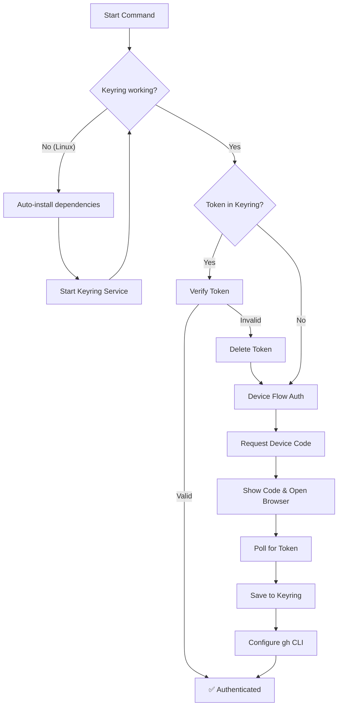

# GitHub Authentication

Configure GitHub CLI authentication for devflow commands.

## Automatic Authentication

When you run `gonew` or other commands requiring GitHub access, devflow automatically:

1. Ensures system keyring is available (auto-installs on Linux if needed)
2. Checks for saved token in keyring
3. If none found, initiates **OAuth Device Flow**



## OAuth Device Flow

When authentication is needed, devflow:

1. Opens your browser to `https://github.com/login/device`
2. Displays a code in the terminal (e.g., `ABCD-1234`)
3. You paste the code and click "Authorize"
4. devflow saves the token automatically

```
┌─────────────────────────────────────────────────────────┐
│  devflow: GitHub authentication required                │
│                                                         │
│  Opening browser... Enter this code: ABCD-1234          │
│                                                         │
│  Waiting for authorization...                           │
└─────────────────────────────────────────────────────────┘
```

## Linux Requirements

On Linux, devflow uses the system keyring (Secret Service). If not installed, devflow will **automatically install** the required packages:

- **Debian/Ubuntu**: `gnome-keyring libsecret-1-0`
- **Fedora**: `gnome-keyring libsecret`
- **Arch**: `gnome-keyring libsecret`

The installation requires `sudo` access. No manual configuration needed.

### Creating a Personal Access Token

1. Go to https://github.com/settings/tokens
2. Click "Generate new token (classic)"
3. Select scopes: `repo`, `read:org`, `delete_repo`
4. Generate and copy the token

## Multi-Account Support

Use the `-owner` flag to create repos in different organizations:

```bash
gonew myapp "Description" -owner=cdvelop
gonew myapp "Description" -owner=tinywasm
gonew myapp "Description" -owner=veltylabs
```

Your account must have write access to the target organization.

## Token Storage

Tokens obtained via Device Flow are securely stored in your **system keyring**:

| Platform | Keyring Backend |
|----------|-----------------|
| **Linux** | Secret Service (GNOME Keyring, KDE Wallet) |
| **macOS** | Keychain |
| **Windows** | Credential Manager |

This provides encrypted, OS-level credential protection. Tokens are never stored in plain text files.

## OAuth App Management

The devflow OAuth App is registered under a **personal GitHub account** (not the tinywasm organization). This is the standard approach for CLI tools (gh, goreleaser, etc.).

- **Manage the app**: https://github.com/settings/developers → OAuth Apps → devflow
- **Client ID**: `Ov23lijHU2vxBCpShn1Q` (defined in `github_auth.go`)

> [!NOTE]
> Organization-owned OAuth Apps require admin permissions and add complexity. Personal OAuth Apps are simpler to manage and work identically for end users.
