# GoNew

Initialize new Go projects with standard devflow structure.

## Overview

`gonew` automates the creation of Go projects, handling:
- Local git initialization
- Remote GitHub repository creation (optional)
- Go module initialization
- Template file generation (README, LICENSE, .gitignore, etc.)
- Initial commit and tagging

```mermaid
graph TD
    A[Start gonew] --> B{Local binary checks}
    B --> C{Remote requested?}
    C -- Yes --> D[Check/Create GitHub Repo]
    C -- No --> E[Local Only Mode]
    D --> F{Success?}
    F -- No --> E
    F -- Yes --> G[Local+Remote Mode]
    E --> H[Create Directory]
    G --> H
    H --> I[Git Init]
    I --> J[Generate README/LICENSE/etc]
    J --> K[Go Mod Init]
    K --> L[Initial Commit]
    L --> M[Create Tag v0.0.1]
    M --> N{Is Remote?}
    N -- Yes --> O[Add Remote & Push]
    N -- No --> P[✅ Done]
    O --> P
```



## Usage

```bash
# Create new project
gonew <repo-name> <description> [flags]

# Add remote to existing local project
gonew add-remote <project-path> [flags]
```

### Flags

| Flag | Description | Default |
|------|-------------|---------|
| `-owner` | GitHub owner/organization | Auto-detected from `gh` or git config |
| `-visibility` | Repository visibility (`public` or `private`) | `public` |
| `-local-only` | Skip remote repository creation | `false` |
| `-license` | License type | `MIT` |

## Examples

### Create a new public project
```bash
gonew my-project "A sample Go project"
```

### Create project with specific owner/organization
```bash
gonew my-lib "Go library" -owner=cdvelop
gonew my-tool "CLI tool" -owner=veltylabs -visibility=private
gonew webapp "Web app" -owner=tinywasm
```

### Create a private library
```bash
gonew my-lib "Go library" -visibility=private
```

### Create local-only project (no GitHub)
```bash
gonew my-tool "CLI tool" -local-only
```

### Add remote to existing project
```bash
gonew add-remote ./my-project -visibility=public
gonew add-remote ./my-project -owner=tinywasm -visibility=private
```

## Features

- **Strict Validation**: Enforces valid repository names and descriptions.
- **Smart Defaults**: Auto-detects git user and GitHub owner, generates MIT license.
- **Multi-Account Support**: Use `--owner` to specify different GitHub accounts/organizations (cdvelop, veltylabs, tinywasm, etc.).
- **Graceful Fallback**: Falls back to local-only mode if GitHub is unavailable.
- **Project Structure**: Sets up `main` branch, `.gitignore` for Go, and initial version `v0.0.1`.
