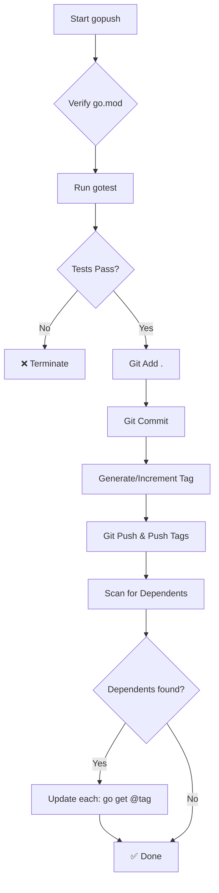

# gopush

Complete Go project workflow: test + git push + update dependents.

## Usage

```bash
gopush "commit message"                    # Auto-generated tag
gopush "commit message" "v1.0.0"           # Specific tag
gopush -m "commit message"                 # Flag syntax
gopush -m "commit message" -t "v1.0.0"     # Flags for both
```

## Options

```
-m              Commit message
-t              Tag (optional, auto-generated if not provided)
--skip-tests    Skip all tests
--skip-race     Skip race detection
--search-path   Path to search for dependent modules (default: "..")
-v              Verbose output
```

## What it does

1. Verifies `go.mod`
2. Runs `gotest` (vet, tests, race, coverage, badges)
3. Commits changes with your message
4. Creates/uses tag
5. Pushes to remote
6. Finds dependent modules in search path
7. Updates dependents: `go get -u module@tag && go mod tidy`



## Output

**Success:**
```
✅ vet ok, ✅ tests stdlib ok, ✅ race detection ok, ✅ coverage: 71%, ✅ Tag: v1.0.1, ✅ Pushed ok
```

**With dependents:**
```
✅ vet ok, ✅ tests stdlib ok, ✅ race detection ok, ✅ coverage: 71%, ✅ Tag: v1.0.1, ✅ Pushed ok, ✅ Updated modules: 2
```

## Examples

```bash
# Simple push
gopush "feat: new feature"

# With specific tag
gopush "fix: critical bug" "v2.1.3"

# Skip race detection (faster)
gopush "docs: update readme" --skip-race

# Skip all tests
gopush "chore: update deps" --skip-tests

# Custom search path for dependents
gopush "refactor: api" --search-path "../projects"
```

## Exit codes

- `0` - Success
- `1` - Tests failed, git operation failed, or verification failed

## Note: Special characters in commit messages

When your commit message contains backticks (`` ` ``), `$`, or other shell special characters, use **single quotes** to prevent shell interpretation:

```bash
# ❌ Backticks will fail (shell tries to execute as commands)
gopush "feat: Add `afterLine` parameter"

# ✅ Use single quotes
gopush 'feat: Add `afterLine` parameter'

# ✅ Or escape backticks
gopush "feat: Add \`afterLine\` parameter"
```
