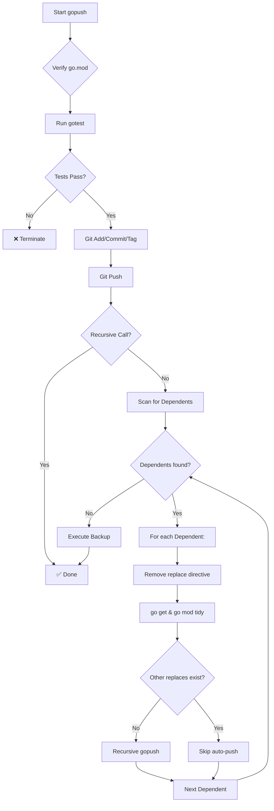

# gopush

Complete Go project workflow: test + git push + update dependents.

## Usage

```bash
gopush 'commit message' [tag]
```

## Arguments

- **commit message**: Required. The message for the git commit.
- **tag**: Optional. The tag to create. If not provided, it will be auto-generated.
- **--skip-race** or **-R**: Optional. Skip race detection tests for faster execution.

## What it does

1. Verifies `go.mod`
2. Runs `gotest` (vet, tests, race, coverage, badges)
3. Commits changes with your message
4. Creates/uses tag
5. Pushes to remote
6. Finds dependent modules in search path
7. For each dependent (in parallel):
   - Removes replace directive for published module
   - Runs `go get module@tag` and `go mod tidy`
   - If no other replaces exist: auto-push with `deps: update X to vY`
   - If other replaces exist: skip push (manual required)
8. Executes backup (asynchronous)



## Output

**Success:**
```
✅ vet ok, ✅ tests stdlib ok, ✅ race detection ok, ✅ coverage: 71%, ✅ Tag: v1.0.1, ✅ Pushed ok
```

**With dependents:**
```
✅ vet ok, ✅ tests stdlib ok, ✅ race detection ok, ✅ coverage: 71%, ✅ Tag: v1.0.1, ✅ Pushed ok, ✅ Updated modules: 2
```

## Examples

```bash
# Simple push
gopush 'feat: new feature'

# With specific tag
gopush 'fix: critical bug' 'v2.1.3'
```

## Exit codes

- `0` - Success
- `1` - Tests failed, git operation failed, or verification failed

## Note: Special characters in commit messages

When your commit message contains backticks (`` ` ``), `$`, or other shell special characters, use **single quotes** to prevent shell interpretation:

```bash
# ❌ Backticks will fail (shell tries to execute as commands)
gopush "feat: Add `afterLine` parameter"

# ✅ Use single quotes
gopush 'feat: Add `afterLine` parameter'

# ✅ Or escape backticks
gopush "feat: Add \`afterLine\` parameter"
```
