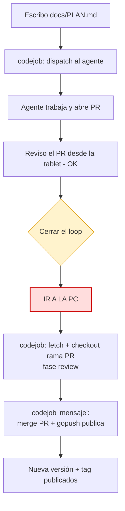
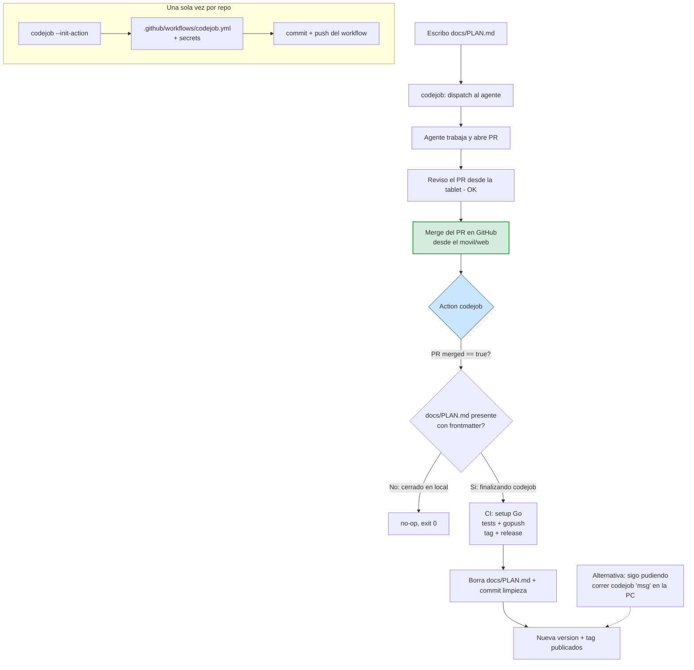

# Plan — Cerrar el loop de `codejob` desde el merge (GitHub Action)

## 1. Problema (justificación)

Hoy `codejob` cierra el loop **solo en local**. El flujo típico cuando un agente
(Jules u otro) termina su tarea es:

1. El agente abre un PR.
2. Reviso el PR desde la tablet — todo bien.
3. **Tengo que ir a la PC** y ejecutar `codejob` → descarga el repo, hace fetch y
   posiciona el árbol en la rama del PR (fase `review`).
4. Ejecuto **otra vez** `codejob 'mensaje'` → fusiona el PR y publica la nueva
   versión (`gopush`: tests, tag, cross-compile, cascade, backup).

El paso 3–4 **obliga a estar físicamente frente al computador** con las
credenciales locales (keyring de Jules, PAT de GitHub, `.env` con la sesión
`CODEJOB`). Cuando la revisión ya se hizo desde el móvil y "todo está bien", ese
viaje a la PC es puro overhead: lo único que falta es *fusionar y publicar*, algo
que no requiere criterio humano adicional.

**Objetivo:** poder **cerrar el PR fusionándolo desde GitHub (móvil/web)** y que
la nueva versión se publique automáticamente, sin abrir la PC. El flujo local
actual se mantiene intacto como alternativa.

## 2. Propuesta

Dos piezas:

### 2.1 Nuevo subcomando: `codejob --init-action`

Genera `.github/workflows/codejob.yml` en el repo **si no existe** (idempotente:
si ya existe, no lo sobreescribe salvo `--force`). El workflow se llama `codejob`.

- Escribe el YAML embebido (`go:embed`) en `.github/workflows/codejob.yml`.
- Verifica/registra los secrets que el publish en CI necesite, reutilizando el
  `GitHub.SetSecret` / `ListSecrets` que **ya existen** en `github_secrets.go`.
- No toca nada más; el usuario revisa, commitea y pushea el workflow una sola vez.

### 2.2 GitHub Action `codejob` (publica al fusionar)

El workflow se activa **solo** cuando se cierra un PR **y** ese cierre es un
**merge** **y** se trata de la finalización de un `codejob`. La discriminación es
la clave del diseño (§3).

Al dispararse, corre en CI el equivalente al *close-loop* de `codejob 'mensaje'`
(publish vía `gopush`): tests → tag → cross-compile/release → limpieza. El
mensaje y el tag salen del **frontmatter de `docs/PLAN.md`** (`PLAN:` / `TAG:`),
exactamente la misma fuente de verdad que ya usa el flujo local vía
`CHECK_PLAN.md`.

## 3. Decisión de diseño clave — cómo distinguir "finalizando un codejob"

El requisito "el action solo debe activarse si es un merge y si estamos
finalizando un codejob" necesita una señal **fiable y sin intervención local**.

La señal elegida: **la presencia de `docs/PLAN.md` (con frontmatter válido) en la
rama por defecto tras el merge.**

Por qué funciona y por qué es robusta frente al doble-publish:

| Escenario de cierre | ¿Queda `docs/PLAN.md` en la rama base? | Quién publica |
|---|---|---|
| **Desde tablet/web** (merge en GitHub) | **Sí** — el flujo local nunca corrió, nunca renombró `PLAN.md`→`CHECK_PLAN.md` | **La Action** |
| **Desde la PC** (`codejob 'msg'`) | **No** — el flujo local ya renombró/borró `PLAN.md` y lo publicó | El flujo local |

Esto hace ambos caminos **mutuamente excluyentes por construcción**: la Action
solo actúa cuando el `PLAN.md` sigue presente, es decir, cuando el loop **no** se
cerró en local. No hace falta coordinación ni locks. (Recordar: en dispatch,
`Send()` commitea y pushea `docs/PLAN.md` con su frontmatter, así que el archivo
está en el historial y viaja a la rama del agente y al merge.)

- **Trigger YAML:** `pull_request: types: [closed]` sobre la rama por defecto.
  No se usa filtro `paths:` porque el PR del agente puede **no** modificar
  `PLAN.md` (si el agente no lo tocó, el diff no lo incluye y `paths` no
  dispararía). El filtrado real se hace en el *guard* del job.
- **Guard del job:** `if: github.event.pull_request.merged == true` (descarta PRs
  cerrados sin merge) **más** un paso que verifica que `docs/PLAN.md` existe y
  tiene frontmatter válido; si no, el job termina en *no-op* (exit 0).
- **Anti-re-trigger:** tras publicar, la Action **borra `docs/PLAN.md`** y commitea
  la limpieza. Ese commit es un `push` directo, no un `pull_request`, así que no
  vuelve a disparar el workflow. Y el gate queda cerrado para futuros eventos.

## 4. Diagramas

### 4.1 Flujo actual (el cuello de botella)



### 4.2 Flujo propuesto (cerrar desde el móvil)



## 5. Alcance de la implementación

### 5.1 Archivos nuevos

- `codejob_action.go` — lógica del subcomando:
  - `InitCodejobAction(force bool) error`: crea `.github/workflows/` si falta,
    escribe el YAML embebido si no existe (o con `--force`), y devuelve mensajes
    claros (creado / ya existe / sobreescrito).
  - Plantilla del workflow embebida con `//go:embed templates/codejob_action.yml`.
- `templates/codejob_action.yml` — el workflow (ver §5.3).
- `codejob_action_test.go` (en `test/`) — cobertura (ver §6).

### 5.2 Archivos modificados

- `cli.go` — parsear el flag `--init-action` (y `--force`) en `ParseCodeJobArgs`,
  devolviendo un nuevo booleano `isInitAction`.
- `cmd/codejob/main.go` — atender `--init-action` antes del flujo normal
  (igual que ya hace con `--reset-gh-token`): llamar a `InitCodejobAction`,
  imprimir resultado y salir.
- `cmd/codejob/main.go` `showHelp()` — documentar el subcomando.
- `docs/CODEJOB.md` y `docs/diagrams/CODEJOB_FLOW.md` — documentar el modo CI y
  actualizar la tabla de uso.

### 5.3 Contenido del workflow (`.github/workflows/codejob.yml`)

**Elección de runner — `ubuntu-latest`, no Alpine.** No es un descuido: en
runners hospedados no existe `runs-on: alpine` (solo Ubuntu/Windows/macOS). Usar
Alpine obliga a `container: alpine` **encima** de un runner Ubuntu → se paga el
arranque de la VM Ubuntu + `docker pull` + `apk add`, resultando **más lento** y
**sin ahorro de costo** (la facturación es por minuto-runner, y el runner sigue
siendo Ubuntu). Además `checkout`/`setup-go`/`gh`/`git` son glibc y vienen
preinstalados en Ubuntu; en Alpine exigen `gcompat`. El valor de Alpine es como
**imagen de despliegue** (runtime), algo ortogonal que ya cubrimos con binarios
`CGO_ENABLED=0` estáticos de `gorelease`. Y como este job **compila** (`gotest` +
cross-compile de 5 targets), quiere las 2 vCPU de `ubuntu-latest` — el "Caso C"
de `docs/codejob/RUNNER_BEST_PRACTICES.md`.

**Bootstrap de la herramienta — binario precompilado, no `go install`.** El
Release ya publica `codejob-<os>-<arch>` + `checksums.txt` (vía `gorelease`);
descargar ese asset y verificar el checksum es más rápido y reproducible que
`go install ...@latest` (que re-resuelve módulos y recompila la herramienta). Es
dogfooding de nuestros propios artefactos. Nota: esto **no** elimina `setup-go`
del runner — el publish en sí (tests + cross-compile del release) necesita el
toolchain; solo dejamos de compilar *la herramienta codejob*. La versión se
**fija** (la estampa `--init-action`, no `@latest`) para builds reproducibles.

```yaml
name: codejob
on:
  pull_request:
    types: [closed]
permissions:
  contents: write   # crear tag, release, push de limpieza
jobs:
  publish:
    # Solo merges reales (descarta PR cerrados sin fusionar)
    if: github.event.pull_request.merged == true
    runs-on: ubuntu-latest
    steps:
      - uses: actions/checkout@v4
        with:
          ref: ${{ github.event.pull_request.base.ref }}
          fetch-depth: 0          # historial completo para tags/gopush
      - name: Gate — ¿estamos finalizando un codejob?
        id: gate
        run: |
          # PLAN.md presente con frontmatter => cierre desde web (no se cerró en local)
          if [ -f docs/PLAN.md ] && head -1 docs/PLAN.md | grep -q '^---'; then
            echo "run=true" >> "$GITHUB_OUTPUT"
          else
            echo "run=false" >> "$GITHUB_OUTPUT"
            echo "No hay codejob pendiente; no-op."
          fi
      - uses: actions/setup-go@v5
        if: steps.gate.outputs.run == 'true'
        with: { go-version: 'stable' }   # necesario: el publish testea + cross-compila
      - name: Bootstrap codejob (binario precompilado del Release)
        if: steps.gate.outputs.run == 'true'
        env:
          GH_TOKEN: ${{ secrets.GITHUB_TOKEN }}
        run: |
          # Versión fijada que estampa 'codejob --init-action' (no @latest)
          VER=v0.5.0
          gh release download "$VER" --repo tinywasm/devflow \
            --pattern 'codejob-linux-amd64' --pattern 'checksums.txt' -O- >/dev/null || \
          gh release download "$VER" --repo tinywasm/devflow \
            --pattern 'codejob-linux-amd64' --pattern 'checksums.txt'
          grep 'codejob-linux-amd64' checksums.txt | sha256sum -c -
          install -m755 codejob-linux-amd64 /usr/local/bin/codejob
      - name: Publicar (close-loop en CI)
        if: steps.gate.outputs.run == 'true'
        env:
          GH_TOKEN: ${{ secrets.GITHUB_TOKEN }}
        run: codejob --ci-publish     # lee frontmatter, publica, limpia PLAN.md
```

> El detalle exacto de los steps (cache de módulos, versión pinneada de la
> herramienta en vez de `@latest`, publicación a repo público separado cuando el
> origin es privado) se afina en implementación. Lo esencial es el par
> **trigger `closed` + guard `merged` + gate `PLAN.md`**.

### 5.4 Nuevo modo `codejob --ci-publish`

Ruta de ejecución **no interactiva** pensada para el runner, que reutiliza la
maquinaria existente sin depender del estado local (`.env`/keyring/PAT):

- No hay sesión `CODEJOB` en `.env` (el runner es efímero): se salta el manejo de
  fases; el PR **ya está fusionado** por GitHub.
- Lee `docs/PLAN.md` con `ReadPlanMeta` → `message` y `tag` (`PLAN:`/`TAG:`).
- Borra `docs/PLAN.md` (equivale al borrado de `CHECK_PLAN.md` del flujo local).
- Llama al `Publisher.Publish(message, tag, ...)` completo (deps + tag + release),
  usando `GITHUB_TOKEN` para push/tag/release.
- **No** despacha planes encadenados en CI (requiere API key de Jules); si tras el
  merge hay un `PLAN.md` nuevo distinto, se deja como *follow-up* opcional (§7).

Esto mantiene una única fuente de verdad para el mensaje/tag (frontmatter) y
reaprovecha `gopush`/`gorelease` sin duplicar lógica.

## 6. Pruebas (test map)

| Comportamiento | Test |
|---|---|
| `InitCodejobAction` crea el workflow si no existe | `TestInitCodejobAction_CreatesWhenAbsent` |
| Es idempotente (no sobreescribe sin `--force`) | `TestInitCodejobAction_NoOverwrite` |
| `--force` sí sobreescribe | `TestInitCodejobAction_ForceOverwrites` |
| El YAML embebido es válido y contiene el guard `merged` + gate `PLAN.md` | `TestCodejobActionTemplate_Contract` |
| `ParseCodeJobArgs` detecta `--init-action` / `--force` | `TestParseCodeJobArgs_InitAction` |
| `--ci-publish` con `PLAN.md` válido publica con msg/tag del frontmatter | `TestCIPublish_UsesFrontmatter` |
| `--ci-publish` sin `PLAN.md` es no-op | `TestCIPublish_NoopWhenNoPlan` |

## 7. Riesgos y decisiones abiertas (para tu aprobación)

1. **Señal de discriminación.** Propongo *presencia de `docs/PLAN.md`* por ser
   cero-fricción. Alternativa más explícita: una **label `codejob`** en el PR
   (más autodocumentada, pero requiere que algo la ponga sin la PC — habría que
   añadir el etiquetado al abrir/detectar el PR). ¿Prefieres archivo o label?
2. **Repos privados con distribución pública.** `gorelease` ya soporta publicar a
   un repo público derivado cuando el origin es privado; en CI eso exige un **PAT
   con acceso al repo público** como secret (`SetSecret` ya existe). Si el repo es
   público, basta `GITHUB_TOKEN`. ¿Incluyo el registro del secret en
   `--init-action`?
3. **Planes encadenados en CI.** El re-dispatch automático necesita la API key de
   Jules como secret. Lo dejo **fuera** del alcance inicial (queda solo-local),
   salvo que lo quieras dentro.
4. **Cascade/backup en CI.** El backup asíncrono y el cascade a módulos
   dependientes asumen entorno local; en CI conviene `--no-cascade` y omitir
   backup. Propongo publicar **solo el módulo** en CI y dejar el cascade al flujo
   local. ¿De acuerdo?

## 8. Resumen

Añadir `codejob --init-action` (scaffolding one-shot del workflow) y un modo
`codejob --ci-publish` que la Action invoca al fusionar un PR de codejob. El
disparo es preciso — merge real **y** `docs/PLAN.md` aún presente — lo que separa
limpiamente el cierre-desde-web (publica la Action) del cierre-en-PC (publica el
flujo local), sin doble publicación. Resultado: cerrar el PR desde el móvil
publica la versión, sin tocar la PC.
</content>
</invoke>
