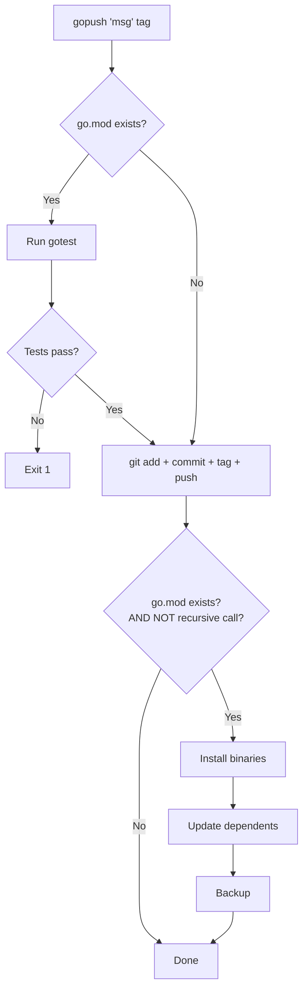
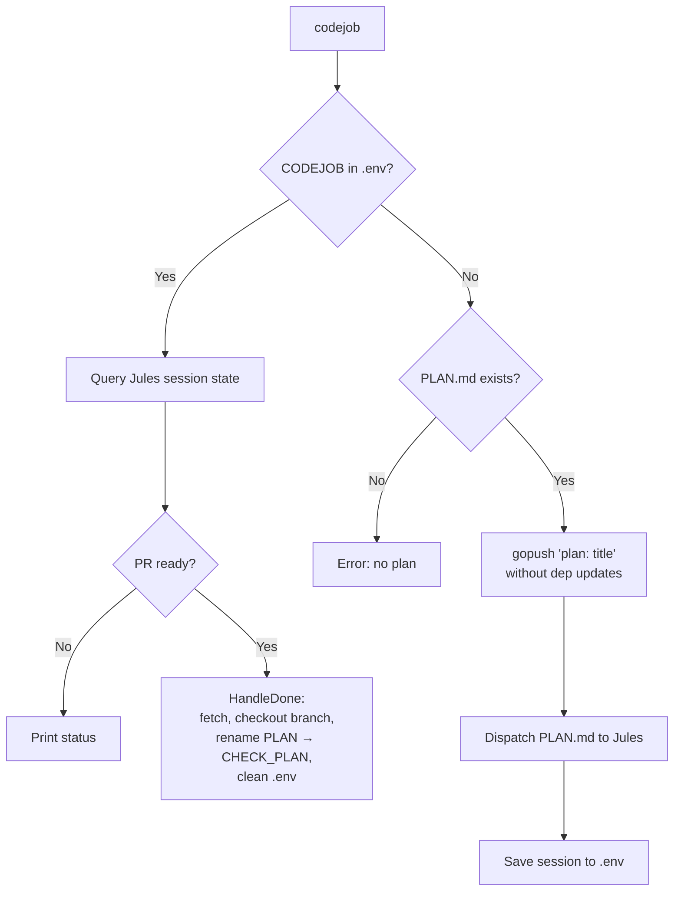
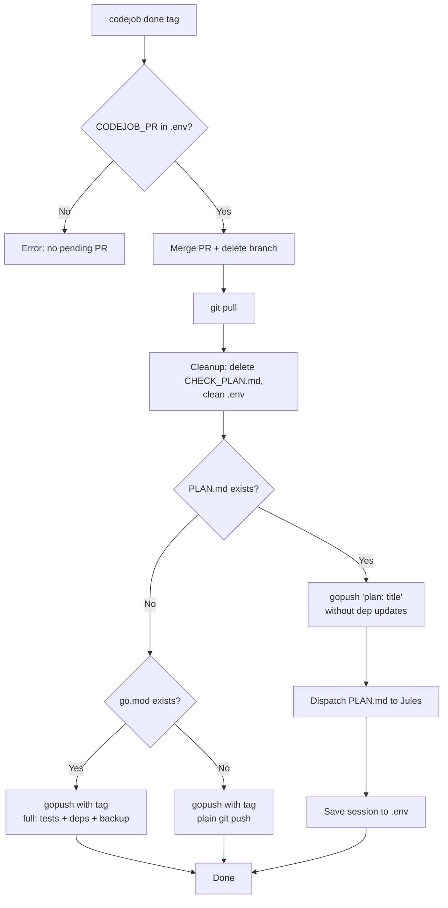

# PLAN: Refactor gopush + codejob

## Development Rules

- **Mandatory DI:** No global state. Interfaces for external deps. Injection only in `cmd/*/main.go`.
- **Standard Library Only:** No external assertion libraries. Mocks for all I/O.
- **Max 500 lines per file.**
- **Testing:** Use `gotest` CLI. Install with `go install github.com/tinywasm/devflow/cmd/gotest@latest`.
- **Diagram-Driven Testing:** Flows in diagrams MUST have corresponding tests.

---

## Summary

Three changes:

1. **Delete `push` tool** — `gopush` absorbs its functionality (auto-detect `go.mod`).
2. **Decouple CodeJob from gopush** — `gopush` no longer dispatches CodeJob. The dependency inverts: `codejob` calls `gopush`.
3. **`codejob done` becomes Go-aware** — publishes via `gopush` and conditionally updates dependents or re-dispatches.

---

## New Flow Diagrams

### gopush (universal)



**Key change:** No CodeJob dispatch. gopush is purely build+publish.

---

### codejob (dispatch — no args)



**Key change:** `codejob` calls `gopush` before dispatching to ensure code is pushed. No dep updates (illogical before agent work).

---

### codejob done



**Key change:** `codejob done` publica via `gopush`. Si hay nuevo PLAN.md → re-dispatch sin actualizar deps. Si no hay plan → ciclo completo.

---

## Execution Steps

### Stage 1: Make gopush universal (delete push)

1. In `go_handler.go`: at the start of `Go.Push()`, detect `go.mod`. If missing, skip tests/install/deps and only run `git.Push()`.
2. Remove `withCodeJob()` call from `git_handler.go` `Git.Push()`.
3. Remove CodeJob-related fields/imports from `Git` struct.
4. Delete `cmd/push/main.go` and its directory.
5. Update `cmd/gopush/main.go` to no longer inject CodeJob drivers into Git.
6. Delete `docs/PUSH.md`.

### Stage 2: codejob calls gopush

1. Add a `Publisher` interface to `interface.go`:
   ```go
   type Publisher interface {
       Publish(message string, tag string) (PushResult, error)
   }
   ```
2. In `codejob.go`: add `Publisher` field to `CodeJob`. Before `Send()`, call `Publisher.Publish()` (without dep updates).
3. In `cmd/codejob/main.go` `runDispatch()`: inject `Go` handler as Publisher.
4. Add a flag/method to `Go.Push()` to skip dependent updates (e.g., `skipDeps` bool parameter or a `PublishOnly()` method).

### Stage 3: codejob done uses gopush

1. Refactor `MergeAndPublish()`:
   - After merge+pull+cleanup, check for `PLAN.md`.
   - If PLAN.md exists → call Publisher.Publish (no deps) + dispatch to Jules.
   - If no PLAN.md → call full `Go.Push()` (with deps if go.mod exists, plain push otherwise).
2. Remove manual tag creation from `MergeAndPublish` — delegate to gopush.
3. In `cmd/codejob/main.go` `runDone()`: inject `Go` handler as Publisher.

### Stage 4: Cleanup and tests

1. Remove `DispatchCodeJob()` function from `codejob.go` (no longer called from git).
2. Remove `withCodeJob()` method from `git_handler.go`.
3. Update all tests in `test/` to reflect new flows.
4. Update `docs/GOPUSH.md` documenting universal behavior.
5. Update codejob diagrams in `docs/codejob/diagrams/`.
6. Remove `docs/PUSH.md` reference from `README.md`.

---

## Files to modify

| File | Action |
|---|---|
| `cmd/push/main.go` | DELETE |
| `cmd/gopush/main.go` | Update (remove CodeJob injection) |
| `cmd/codejob/main.go` | Update (inject Publisher) |
| `git_handler.go` | Remove `withCodeJob()`, CodeJob fields |
| `go_handler.go` | Add go.mod detection, skipDeps flag |
| `codejob.go` | Add Publisher field, call before Send |
| `codejob_state.go` | Refactor MergeAndPublish to use Publisher |
| `interface.go` | Add Publisher interface |
| `docs/PUSH.md` | DELETE |
| `docs/GOPUSH.md` | Update |
| `docs/codejob/diagrams/*.md` | Update all |
| `README.md` | Remove push references |
| `test/*` | Update affected tests |
