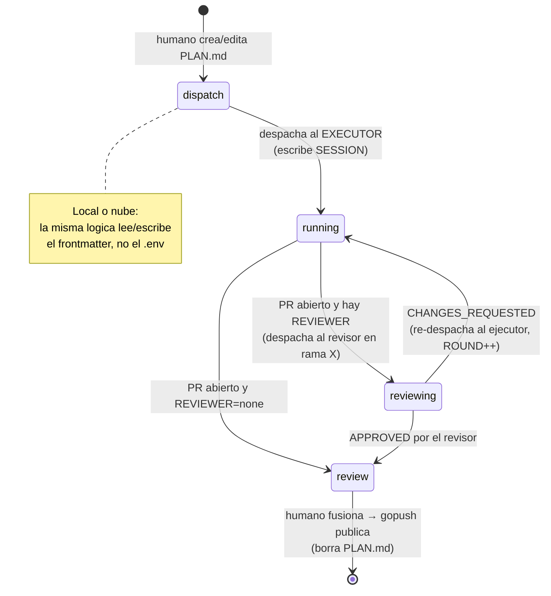
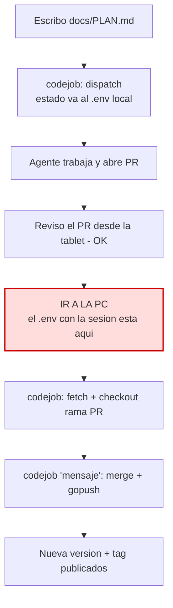
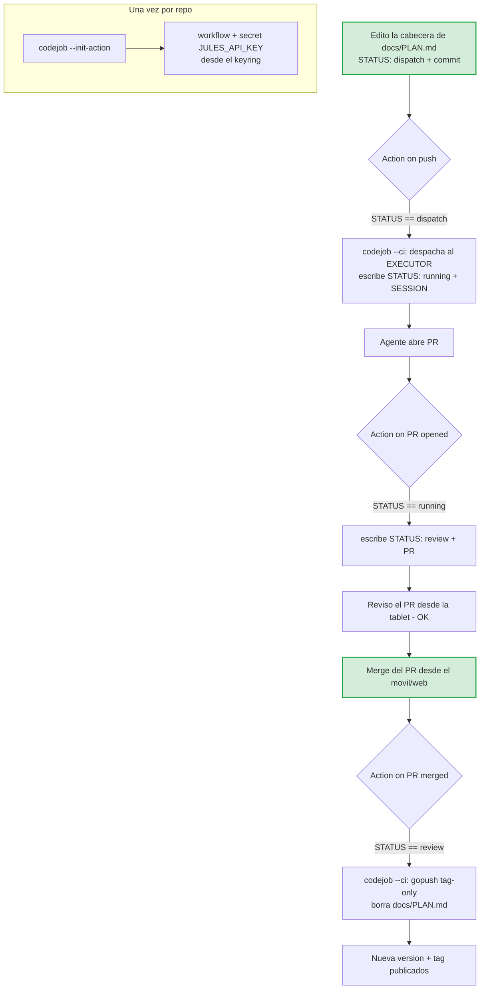

# Plan — Estado único en `docs/PLAN.md` y loop completo en la nube

## 1. Problema (justificación)

Hoy el estado de `codejob` está **repartido en dos lugares**:

- **`.env`** → la sesión activa: `CODEJOB=jules:running:SESSION_ID` /
  `jules:review:PR_URL`. Es **efímero, local y gitignored**.
- **`docs/PLAN.md`** → la tarea + frontmatter (`PLAN`, `TAG`). Además, durante la
  revisión se renombra a `docs/CHECK_PLAN.md` (también gitignored).

Consecuencia: el ciclo (dispatch → poll → review → publish) **solo puede vivir en
la PC**, porque el `.env` con la sesión nunca sale del disco local. Un runner de
la nube es efímero y arranca sin ese estado, así que no puede continuar el loop.
El flujo típico obliga a ir a la PC a ejecutar `codejob` dos veces (posicionar la
rama y luego fusionar+publicar) aunque la revisión ya se hizo desde el móvil.

**Objetivo:** mover **todo** el estado al **frontmatter de `docs/PLAN.md`** y dejar
de usar `.env`. Como el frontmatter se commitea, cada transición queda en git y el
loop entero se puede ejecutar en la nube:

> Fusiono el PR desde el móvil → se publica.
> Edito la cabecera de `docs/PLAN.md`, hago commit → se despacha el siguiente
> trabajo. **Sin abrir la PC en ningún momento.**

## 2. Propuesta (cuatro piezas)

1. **Estado único en el frontmatter** (§3) — retirar `.env` y `CHECK_PLAN.md`.
2. **Roles ejecutor + revisor** (§3.7) — un agente revisor opcional como compuerta
   de calidad antes del humano, declarado en el frontmatter.
3. **Modo `codejob --ci`** (§6) — ejecución no interactiva que la Action invoca:
   lee el frontmatter, ejecuta la fase que corresponda y **escribe el nuevo estado
   de vuelta en el frontmatter** (commit).
4. **`codejob --init-action`** (§6) — genera `.github/workflows/codejob.yml` y
   registra los secrets con **la misma nomenclatura del keyring** (§3.3).

## 3. Modelo de estado — fuente única en el frontmatter

### 3.1 Claves del frontmatter

```markdown
---
PLAN: "feat: lo que implementa este plan"   # requerido — mensaje de commit al cerrar
TAG: v0.5.0                                  # opcional  — versión (omitido = auto-bump)
EXECUTOR: jules                              # opcional  — agente que implementa (default: jules)
REVIEWER: none                               # opcional  — agente que revisa el PR (none = solo humano)
STATUS: dispatch                             # gestionado por la máquina
SESSION: sessions/abc123                     # gestionado — sesión del ejecutor
REVIEW_SESSION: sessions/def456             # gestionado — sesión del revisor (si REVIEWER)
ROUND: 0                                     # gestionado — nº de ida-vuelta ejecutor↔revisor
PR: https://github.com/o/r/pull/7            # gestionado — PR abierto por el ejecutor
---
```

| Clave | Quién la escribe | Significado |
|---|---|---|
| `PLAN` | humano | Mensaje de commit del cierre (requerido). |
| `TAG` | humano | Versión explícita (opcional). |
| `EXECUTOR` | humano | Agente que implementa (antes `AGENT`; `jules` por defecto). |
| `REVIEWER` | humano | Agente que revisa el PR. `none`/ausente = solo revisión humana (comportamiento actual). |
| `STATUS` | máquina | `dispatch` → `running` → `reviewing` → `review`. |
| `SESSION` | máquina | Sesión del ejecutor (fase `running`). |
| `REVIEW_SESSION` | máquina | Sesión del revisor (fase `reviewing`). |
| `ROUND` | máquina | Rondas ejecutor↔revisor, con tope anti-bucle (§3.7). |
| `PR` | máquina | URL del PR abierto por el ejecutor. |

`STATUS: dispatch` (o `STATUS` ausente) = "pendiente de despachar", exactamente el
mismo criterio que hoy es "no hay `CODEJOB` en `.env` y existe `PLAN.md`". El valor
es **derivable** de las demás claves, pero mantenerlo explícito hace el *gate* de la
Action trivial y legible por un humano. La fase `reviewing` solo aparece si hay un
`REVIEWER`; sin él, el flujo va directo de `running` a `review` (humano).

### 3.2 Máquina de estados (cada arista es un commit)



- **dispatch → running:** `codejob` (local **o** `--ci`) envía el plan al
  `EXECUTOR`, guarda `STATUS: running` + `SESSION`, commitea.
- **running → reviewing / review:** al abrirse el PR, si hay `REVIEWER` se despacha
  al revisor (§3.7); si no, pasa directo a `review` (humano).
- **reviewing → running / review:** según el veredicto del revisor (cambios o
  aprobado).
- **review → cerrado:** el humano fusiona → se publica (`gopush`, tag-only) y se
  **borra `docs/PLAN.md`** (el commit de cierre usa el mensaje de `PLAN:`).

### 3.3 Nomenclatura del token (break change limpio)

**El nombre es idéntico en keyring, variable de entorno y secret de GitHub.** Sin
mapeos, sin `ToUpper`, sin alias deprecados. Se renombran las claves del keyring
para que coincidan exactamente con el secret:

| Uso | Nombre único (keyring = env = secret) | Antes (se elimina) |
|---|---|---|
| Agente (Jules) | `JULES_API_KEY` | `jules_api_key` |
| Token de GitHub | `GH_TOKEN` | `github_pat`, `github_token` |

Dos restricciones de GitHub que fijan estos nombres:

1. **Los secrets de Actions no pueden empezar por `GITHUB_`** (prefijo reservado).
   Por eso el token de GitHub usa `GH_TOKEN` — además es el nombre estándar que el
   `gh` CLI ya lee de la variable de entorno.
2. **Un commit hecho con el `GITHUB_TOKEN` por defecto no dispara otros
   workflows** (anti-bucle de GitHub). Como el loop encadena "commit del `STATUS`
   → dispara la siguiente Action", el PAT `GH_TOKEN` es **necesario** para que el
   despacho automático en cadena funcione en la nube.

- `codejob --ci` lee `JULES_API_KEY` y `GH_TOKEN` de variables de entorno (que la
  Action inyecta desde los secrets); en local, del keyring bajo el mismo nombre.
- `codejob --init-action` lee esos valores del keyring y los registra como secrets
  con el `GitHub.SetSecret` que ya existe. **Un solo identificador en todas partes.**

Es un **break change**: no hay código de compatibilidad ni migración automática de
las claves viejas (evitamos "código basura por deprecados"). El cambio es manual y
documentado (§3.6).

### 3.4 Registrar los secrets una sola vez por organización

GitHub soporta **secrets a nivel de organización**: se definen una vez y quedan
disponibles para todos (o los repos seleccionados) de la org.

| Ámbito | ¿Secret único para todos los repos? | Cómo |
|---|---|---|
| Org (`tinywasm`, y tu otra org) | **Sí** | `gh secret set JULES_API_KEY --org tinywasm --visibility all` (ídem `GH_TOKEN`) |
| Cuenta personal (`cdvelop`) | **No** — GitHub no tiene secrets de cuenta que cubran todos tus repos personales | Por-repo: `gh secret set … --repo cdvelop/<repo>` (scriptable en bucle) |

`codejob --init-action` aceptará `--org <nombre> [--visibility all|selected]` para
registrar a nivel de organización (así, para todo lo que vive en `tinywasm`, lo
seteas **una vez**). Para los repos personales de `cdvelop` se registra por repo.

### 3.5 Qué se retira (sin código de compatibilidad)

Break change limpio: se **elimina** el código viejo, no se mantiene deprecado.

- **Claves de keyring antiguas:** `jules_api_key`, `github_pat`, `github_token` →
  reemplazadas por `JULES_API_KEY` y `GH_TOKEN`. Sin alias ni lectura de las viejas.
- **`.env` para estado de codejob:** se elimina la clave `CODEJOB` y todo su
  parseo (incluido el formato legacy y `CODEJOB_PR`). devflow deja de leer/escribir
  `.env`. (No borramos el `.env` del usuario; solo dejamos de tocarlo.)
- **`docs/CHECK_PLAN.md`:** ya no hace falta el renombrado — `STATUS: review`
  marca la fase de revisión. Se elimina también el truco `.gitignore CHECK_*.md`.

Sin migración automática. Coste único al actualizar: si hay una sesión en vuelo
guardada en `.env`, se re-despacha (raro y de una sola vez); las claves se vuelven
a añadir (§3.6). Esto evita arrastrar código de migración indefinidamente.

### 3.6 Renombrar las claves del keyring a mano (documentado)

Como no hay migración automática, el cambio de nombre se hace una vez. **Camino
simple (recomendado):** ejecuta `codejob`; al no encontrar la clave bajo el nombre
nuevo, te la pide y la guardas. Listo.

**Limpieza opcional** de las entradas viejas (servicio de keyring `devflow`):

```bash
# Linux (libsecret)
secret-tool clear service devflow username jules_api_key
secret-tool clear service devflow username github_pat
secret-tool clear service devflow username github_token

# macOS (Keychain)
security delete-generic-password -s devflow -a jules_api_key
security delete-generic-password -s devflow -a github_pat

# Windows: Administrador de credenciales → buscar "devflow"
```

Esto se documentará en `docs/CODEJOB.md` para corregirlo manualmente sin adivinar.

### 3.7 Roles de agente: ejecutor y revisor

Hoy el modelo es **agente = ejecutor, humano = revisor**. Añadimos un eje de
**rol** para insertar, opcionalmente, un **agente revisor** antes del humano. Esto
encaja con la definición original de CodeJob (orquestar una *secuencia* de drivers):
ahora cada driver declara su rol, `executor` o `reviewer`.

- El humano declara los roles en el frontmatter: `EXECUTOR: <agente>` y
  `REVIEWER: <agente|none>`. Un mismo backend (p. ej. Jules) puede registrarse en
  ambos roles con prompts distintos, o el revisor puede ser de otro proveedor.
- **El revisor es una compuerta de calidad *antes* del humano, no lo reemplaza.**
  Tú sigues fusionando el PR, que es lo que publica (mantienes el control final).

**El flujo que describiste, paso a paso:**

1. El ejecutor abre el PR en la rama `X`.
2. El evento `pull_request opened` dispara la Action: si `REVIEWER != none`,
   `codejob` **despacha un job de revisión** al agente revisor con:
   - **rama** = `X` (la cabeza del PR),
   - **indicaciones** = "revisa este PR contra `docs/PLAN.md`" (+ guía opcional, ver
     abajo),
   guarda `REVIEW_SESSION`, `STATUS: reviewing`, y commitea.
3. El revisor entrega su resultado como una **review nativa de GitHub**
   (`APPROVED` / `CHANGES_REQUESTED`) en el PR. Ventaja doble: **tú la ves** en el
   PR y la **máquina la lee** (`gh pr view --json reviews`). No inventamos formato.
4. `codejob` lee el veredicto:
   - **APPROVED** → `STATUS: review` → tu revisión final → fusionas → publica.
   - **CHANGES_REQUESTED** → **re-despacha al ejecutor** en la misma rama `X` con
     los comentarios de la review como feedback; `STATUS: running`, `ROUND++`.
5. **Tope anti-bucle:** si `ROUND` supera `N` (p. ej. 3), se corta el ping-pong y
   `STATUS: review` con nota "el revisor no convergió, decide tú". Sin bucles infinitos.

**Dónde viven las "indicaciones de revisión".** Por defecto el contrato es el propio
`docs/PLAN.md` ("¿la rama X cumple este plan?"). Opcionalmente, un
`REVIEW_GUIDE: docs/REVIEW.md` con criterios extra (estilo, seguridad, cobertura)
que se añaden al prompt del revisor.

**Impacto en la interfaz de driver.** El job pasa de `Send(prompt, title)` a llevar
un `JobSpec{Role, Branch, PlanPath, Prompt, Title}`: el rol y la rama `X` son lo que
distingue "implementar el plan" de "revisar el PR de la rama X".

> Esto también **resuelve la pregunta 3**: el evento `pull_request opened` deja de
> ser cosmético — es el gancho que lanza al revisor. Con revisores, la **opción B**
> es la natural. (Sin `REVIEWER`, sigue valiendo la opción A: `running → review`
> directo al fusionar.)

## 4. Disparo de las Actions (revisado sobre el estado unificado)

Con el estado en el frontmatter, el *gate* de cada Action es leer `STATUS`:

| Evento GitHub | Guard | Acción |
|---|---|---|
| `push` a la rama base que toca `docs/PLAN.md` | `STATUS == dispatch` | **Despachar** al `EXECUTOR` (`codejob --ci`). Requiere `JULES_API_KEY` + `GH_TOKEN`. |
| `pull_request` abierto por el ejecutor | `STATUS == running`, PR = `SESSION`, `REVIEWER != none` | **Despachar al revisor** en la rama `X`; `STATUS: reviewing` + `REVIEW_SESSION`. |
| `pull_request` abierto por el ejecutor | `STATUS == running`, `REVIEWER == none` | `STATUS: review` + `PR` (revisión humana). |
| `pull_request_review` enviada por el revisor | `STATUS == reviewing`, review = `REVIEW_SESSION` | `APPROVED` → `STATUS: review`. `CHANGES_REQUESTED` → re-despacha al ejecutor, `ROUND++` (o corta si `ROUND > N`). |
| `pull_request` `closed` + `merged == true` | `STATUS == review` y `PLAN.md` presente | **Publicar** (`gopush`, tag-only), borrar `PLAN.md`. |

**Por qué el PAT `GH_TOKEN` y no el `GITHUB_TOKEN` por defecto:** cada transición
escribe el nuevo `STATUS` y **commitea**. Ese commit debe disparar la siguiente
Action (p. ej. `dispatch → running` deja el árbol listo para el PR). GitHub, por
diseño anti-bucle, **no dispara workflows por commits hechos con el
`GITHUB_TOKEN`**. El PAT `GH_TOKEN` sí los dispara → es lo que sostiene el
encadenado en la nube.

**Exclusión mutua sin locks:** el gate de publicación exige `STATUS == review` con
`PLAN.md` presente. Si el cierre se hizo en la PC (`codejob 'msg'` ya publicó y
borró `PLAN.md`), la Action encuentra el archivo ausente y hace *no-op*. Nube y PC
siguen siendo mutuamente excluyentes, ahora con una señal más precisa que "el
archivo existe": el propio `STATUS`.

## 5. Diagramas

### 5.1 Flujo actual (el cuello de botella)



### 5.2 Flujo propuesto (loop completo en la nube)



Todo ocurre sin tocar la PC: editar/commitear despacha; fusionar publica.

## 6. Alcance de la implementación

### 6.1 Estado en el frontmatter

- `frontmatter.go` — extender `PlanMeta` con `Executor`, `Reviewer`, `Status`,
  `Session`, `ReviewSession`, `Round`, `PR`; añadir constantes de clave y un
  **escritor** que actualice solo el bloque de frontmatter preservando el cuerpo
  (hoy `tinywasm/markdown` solo lo lee).
- `interface.go` — introducir el eje de **rol** en el driver: `CodeJobDriver` pasa
  de `Send(prompt, title)` a `Send(JobSpec{Role, Branch, PlanPath, Prompt, Title})`
  (§3.7); registrar drivers por rol (`executor`/`reviewer`).
- Nuevo: lógica de despacho del revisor y lectura del veredicto de la review de
  GitHub (`gh pr view --json reviews`), con el tope de `ROUND`.
- `codejob.go` / `codejob_state.go` — **eliminar** la lectura/escritura de `.env`
  (`LoadCodejobState`/`SaveCodejobState`, parseo legacy, `CODEJOB_PR`) y operar
  sobre el frontmatter; eliminar el renombrado a `CHECK_PLAN.md` (`HandleDone`,
  `MergeAndPublish`, `.gitignore`). Sin código de migración (§3.5).
- `codejob_auth.go` / `codejob_gh_auth.go` — **renombrar** las claves de keyring a
  `JULES_API_KEY` y `GH_TOKEN` (borrar `jules_api_key`, `github_pat`,
  `github_token`, sin alias). Leer primero de la variable de entorno del **mismo
  nombre** (para CI), cayendo al keyring en local.

### 6.2 Modos de CLI y Action

- `codejob --ci` — orquestador no interactivo para el runner: lee `STATUS` del
  frontmatter y ejecuta la fase (dispatch / sync-PR / publish), escribiendo el
  nuevo estado de vuelta y commiteando (con `GH_TOKEN` para que dispare la
  siguiente Action). Publica con `gopush` **tag-only** (sin `gorelease`).
- `codejob --init-action [--org <nombre> [--visibility all|selected]]` — crea
  `.github/workflows/codejob.yml` (idempotente, `--force` sobreescribe) y registra
  `JULES_API_KEY` + `GH_TOKEN` desde el keyring, a nivel de **repo** o de **org**
  (§3.4). `github_secrets.go` gana soporte `--org`/`--visibility` sobre el
  `SetSecret` existente.
- `cli.go` — parsear `--ci`, `--init-action`, `--force`, `--org`, `--visibility`.
- `cmd/codejob/main.go` — atender los nuevos flags y actualizar `showHelp()`.

### 6.3 Workflow (decisiones ya acordadas)

- **Runner `ubuntu-latest`, no Alpine.** No existe `runs-on: alpine`; Alpine-en-
  contenedor es más lento y no ahorra costo (facturación por minuto-runner), y
  `gh`/`git`/gcc vienen preinstalados. La carga real es `go install` + `gotest`
  (con race detector, que quiere cgo/gcc y es problemático bajo musl). Alpine solo
  aporta como imagen de despliegue, algo ortogonal.
- **Bootstrap `go install` pinneado** (no binario descargado): como el flujo es
  `gopush` tag-only (sin `gorelease`), los releases no llevan assets binarios que
  descargar. `go install ...cmd/codejob@vX.Y.Z` fijado a versión es el bootstrap
  correcto (Go ya está para `gotest`).
- **Docs:** actualizar `docs/CODEJOB.md` y `docs/diagrams/CODEJOB_FLOW.md`.

## 7. Pruebas (test map)

| Comportamiento | Test |
|---|---|
| Leer estado (`STATUS`/`SESSION`/`PR`) del frontmatter | `TestPlanState_Read` |
| Escribir estado preservando el cuerpo del `PLAN.md` | `TestPlanState_WritePreservesBody` |
| Auth lee de env var (CI) y cae al keyring (local), mismo nombre | `TestAuth_EnvThenKeyring` |
| `--init-action` registra secret a nivel de repo y de `--org` | `TestInitAction_SecretScope` |
| `--ci` en `dispatch` despacha y escribe `running` | `TestCI_DispatchTransition` |
| `--ci` en `review` publica (tag-only) y borra `PLAN.md` | `TestCI_PublishTransition` |
| `--ci` publica es no-op si `PLAN.md` ausente | `TestCI_NoopWhenNoPlan` |
| `--init-action` crea el workflow (idempotente/`--force`) | `TestInitCodejobAction_*` |
| PR abierto con `REVIEWER` set → despacha revisor en rama X | `TestReviewer_DispatchOnPR` |
| Veredicto `APPROVED` → `review`; `CHANGES_REQUESTED` → `running`+`ROUND++` | `TestReviewer_VerdictTransitions` |
| Tope de rondas: `ROUND > N` corta a revisión humana | `TestReviewer_RoundCap` |

## 8. Riesgos y decisiones abiertas (para tu aprobación)

1. **Estado commiteado en el historial.** `SESSION`/`PR` quedan en git para
   siempre. No son secretos (el PR URL es público; el session ID es un
   identificador), pero es ruido en el historial. ¿Aceptable? (Alternativa:
   comprimir las transiciones intermedias, pero perderíamos la trazabilidad.)
2. **Conflictos de edición.** Máquina y humano escriben el mismo archivo. Mitigación:
   la máquina toca **solo** el bloque de frontmatter; el humano, el cuerpo. ¿Ok?
3. **~~Poll de `running`~~ (resuelto por §3.7).** Con el agente revisor, la
   transición `running → …` se dispara por el evento `pull_request opened` (opción
   B), que ahora es load-bearing. Sin `REVIEWER`, vale la opción A (directo a
   `review` al fusionar). Ya no hace falta cron.
4. **Despacho encadenado en la nube.** Con `JULES_API_KEY` + `GH_TOKEN` como
   secrets, el despacho automático ya es posible en CI (era el único bloqueo). ¿Lo
   habilito de una vez o lo dejo tras una bandera para estrenarlo con cuidado?
5. **Cascade/backup en CI.** Asumen entorno local; propongo `--no-cascade` y sin
   backup en el runner (publicar solo el módulo), dejando el cascade al flujo local.
6. **Alcance de los secrets.** Para todo lo de la org `tinywasm` (y tu otra org),
   `--init-action --org` los setea **una vez** para todos los repos. Para tus repos
   personales de `cdvelop` no hay secret de cuenta: es por-repo. ¿Confirmas registro
   por org donde se pueda y por-repo en `cdvelop`?

**Decisiones del agente revisor (§3.7):**

7. **¿El revisor juzga o corrige?** Propongo que **juzgue** (postea una review
   APPROVED/CHANGES_REQUESTED) y que corregir sea re-despachar al ejecutor. La
   variante "el revisor empuja fixes a la rama X" es posible pero difumina roles.
8. **¿APPROVED del revisor pasa a tu revisión final, o auto-merge?** Recomiendo
   mantener **tu** fusión como gatillo de publicación (control final humano); el
   revisor solo te ahorra trabajo previo. ¿O prefieres auto-merge al aprobar?
9. **Tope de rondas `N`.** ¿2 o 3 ida-vueltas ejecutor↔revisor antes de pasarte el
   control?
10. **¿Un revisor o varios?** v1 con un `REVIEWER`; se puede generalizar a una lista
    en cadena después. ¿Suficiente con uno por ahora?

## 9. Resumen

Consolidar todo el estado de `codejob` en el frontmatter de `docs/PLAN.md`
(`STATUS`/`SESSION`/`PR`/`ROUND` junto a `PLAN`/`TAG`/`EXECUTOR`/`REVIEWER`) y
retirar `.env` y `CHECK_PLAN.md`. Como cada transición es un commit, el loop
completo —despachar, revisar y publicar— se ejecuta en la nube: editar la cabecera
y commitear despacha; fusionar el PR publica. Se añade un **eje de rol** para
insertar un **agente revisor** opcional antes del humano (ejecutor abre PR → revisor
lo juzga con una review nativa de GitHub → cambios re-despachan al ejecutor, o
aprobado pasa a tu fusión final), con tope de rondas anti-bucle. Los tokens usan
**un solo nombre en keyring, env y secret** (`JULES_API_KEY`, `GH_TOKEN`) como break
change limpio, sin alias ni migración de código; el renombrado en el keyring se hace
a mano y está documentado. Los secrets se registran una vez por organización donde
se pueda. Nada de esto requiere abrir la PC.
