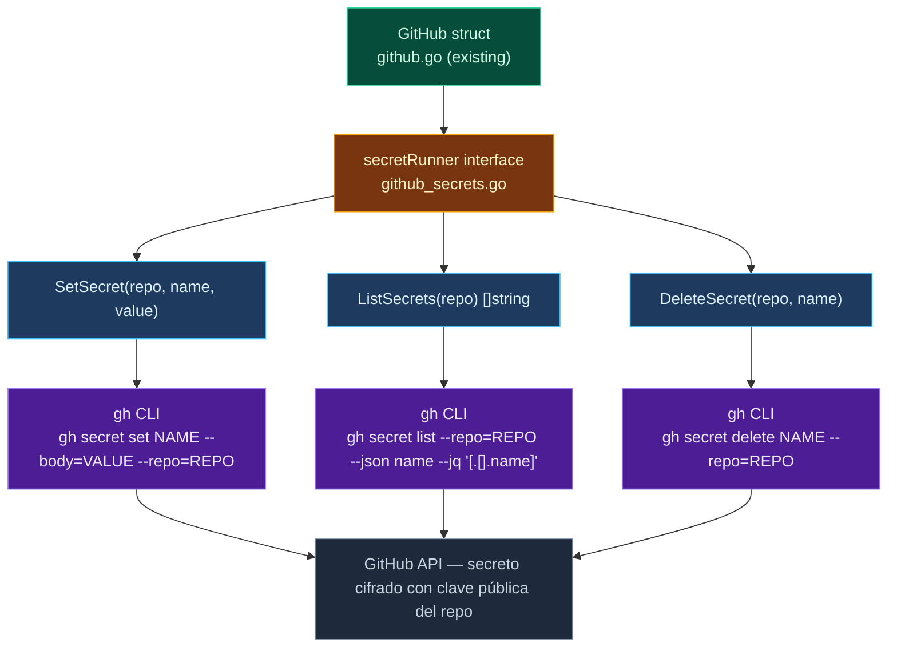

# devflow — GitHub Secrets Plan

## Contexto

`devflow` ya tiene:
- `Keyring` — almacenamiento seguro local (`keyring.go`)
- `GitHub` — wrapper sobre `gh` CLI (`github.go`)
- `GitHubAuth` — Device Flow OAuth (`github_auth.go`)

Falta: capacidad de gestionar **GitHub Actions Secrets** desde Go.
Esto completa el ciclo de gestión de credenciales del ecosistema tinywasm,
permitiendo que `goflare` pueda propagar tokens desde el keyring local
hacia los runners de CI/CD sin intervención manual del dev en la UI de GitHub.

## Responsabilidad de este paquete

`devflow` sabe hablar con GitHub. Nada más.
No sabe qué secretos necesita `goflare` ni para qué se usan.
Expone métodos genéricos: `SetSecret`, `ListSecrets`, `DeleteSecret`.

---

## Implementación — `github_secrets.go`

Archivo nuevo. Métodos sobre `*GitHub` (mismo receiver que `github.go`).
SRP: `github.go` gestiona repos, `github_secrets.go` gestiona secrets.

### Mock pattern

`RunCommand` y `RunCommandSilent` son funciones globales en `executor.go` —
no son mockeables directamente. El patrón real de devflow es mockear a nivel
de interfaz (ver `mock_github_auth.go` → `GitHubAuthenticator`).

`github_secrets.go` define una interfaz interna `secretRunner` con los dos
métodos que necesita. El `GitHub` struct la satisface con las funciones globales
por defecto. Los tests inyectan un fake:

```go
// secretRunner abstrae la ejecución de comandos para testabilidad.
// Implementado por defecto con RunCommand/RunCommandSilent del paquete.
type secretRunner interface {
    run(name string, args ...string) (string, error)
    runSilent(name string, args ...string) (string, error)
}

// defaultRunner usa las funciones globales del paquete.
type defaultRunner struct{}
func (defaultRunner) run(name string, args ...string) (string, error)       { return RunCommand(name, args...) }
func (defaultRunner) runSilent(name string, args ...string) (string, error) { return RunCommandSilent(name, args...) }
```

`GitHub` gana un campo opcional `secretsRunner secretRunner` (nil = usa `defaultRunner`).
Los tests setean `gh.secretsRunner = &fakeRunner{...}` directamente.

### Métodos

```go
// SetSecret registra un secreto en GitHub Actions via gh CLI.
// gh secret set NAME --body=VALUE --repo=OWNER/REPO
// El valor pasa por --body — gh CLI lo cifra con la clave pública del repo
// antes de transmitirlo. No aparece en ps/logs del sistema.
func (gh *GitHub) SetSecret(repo, name, value string) error

// ListSecrets devuelve los nombres de secretos registrados en el repo.
// Los valores nunca son accesibles via API — GitHub solo expone nombres.
// gh secret list --repo=OWNER/REPO --json name --jq '[.[].name]'
// Salida de jq: ["CF_TOKEN","GH_PAT"]  (array plano de strings)
func (gh *GitHub) ListSecrets(repo string) ([]string, error)

// DeleteSecret elimina un secreto de GitHub Actions.
// gh secret delete NAME --repo=OWNER/REPO
func (gh *GitHub) DeleteSecret(repo, name string) error
```

Helper interno:

```go
// parseJSONStringArray parsea la salida de jq '[.[].name]' → []string.
// Entrada esperada: ["CF_TOKEN","GH_PAT"]   (array plano, no nested)
// Entrada vacía:   []                        → []string{}
func parseJSONStringArray(s string) []string
```

> **Corrección**: el ejemplo anterior en el plan tenía `[["CF_TOKEN","GH_PAT"]]`
> (array nested). La salida real de `jq '[.[].name]'` es `["CF_TOKEN","GH_PAT"]`
> (array plano). El parser debe manejar el caso vacío `[]` sin error.

---

## Diagrama



---

## Tests — `test/github_secrets_test.go`

Archivo nuevo. Tests de `github_secrets.go` exclusivamente.
Mock via `secretRunner` interface — sin invocar `gh` real.

```go
package devflow_test

// fakeRunner captura los args del último comando ejecutado
// y devuelve output/error configurados.
type fakeRunner struct {
    lastArgs []string
    output   string
    err      error
}
func (f *fakeRunner) run(name string, args ...string) (string, error)       { ... }
func (f *fakeRunner) runSilent(name string, args ...string) (string, error) { ... }

// newTestGitHub crea un *GitHub con fakeRunner inyectado.
// Evita llamar a NewGitHub() real (que requiere gh instalado + auth).
func newTestGitHub(fake *fakeRunner) *devflow.GitHub
```

### Casos

```
TestSetSecret_CommandArgs
  — verifica: gh secret set CF_TOKEN --body=abc123 --repo=owner/repo
  — el valor debe estar en --body, no como argumento posicional

TestSetSecret_ErrorWrapped
  — fake devuelve error
  — verifica: el error incluye el nombre del secreto y el repo

TestListSecrets_ParsesFlatArray
  — fake devuelve: ["CF_TOKEN","GH_PAT"]
  — verifica: []string{"CF_TOKEN","GH_PAT"}

TestListSecrets_EmptyArray
  — fake devuelve: []
  — verifica: []string{} sin error

TestDeleteSecret_CommandArgs
  — verifica: gh secret delete CF_TOKEN --repo=owner/repo

TestDeleteSecret_ErrorWrapped
  — fake devuelve error
  — verifica: el error incluye nombre + repo
```

---

## Scope OAuth — verificación

`github_auth.go:145` define los scopes del Device Flow:

```go
data.Set("scope", "repo read:org delete_repo")
```

El scope `repo` incluye `secrets:write` (permisos de secrets en repos privados y públicos).
No se requiere cambio de scopes. ✓

---

## Documentación — `docs/GITHUB.md`

Añadir sección al final:

```markdown
## GitHub Actions Secrets

Gestiona GitHub Actions Secrets desde Go sin acceder a la UI de GitHub.
El scope `repo` (ya incluido en el Device Flow de devflow) cubre `secrets:write`.

    gh, _ := devflow.NewGitHub(log)

    gh.SetSecret("owner/repo", "CF_TOKEN", token)     // registrar
    names, _ := gh.ListSecrets("owner/repo")           // ["CF_TOKEN"]
    gh.DeleteSecret("owner/repo", "CF_TOKEN")          // eliminar

Los valores son cifrados por `gh` CLI con la clave pública del repo
antes de transmitirse. El valor en texto plano nunca sale del proceso local.
```

---

## Archivos

| Archivo | Cambio |
|---------|--------|
| `github_secrets.go` | nuevo — `secretRunner` interface + `SetSecret`, `ListSecrets`, `DeleteSecret`, `parseJSONStringArray` |
| `test/github_secrets_test.go` | nuevo — `fakeRunner` + 6 casos |
| `docs/GITHUB.md` | +sección "GitHub Actions Secrets" |

---

## Checklist

- [ ] `github_secrets.go` — interface `secretRunner` + `defaultRunner`
- [ ] `github_secrets.go` — campo `secretsRunner` en `GitHub` struct (nil-safe)
- [ ] `github_secrets.go` — `SetSecret(repo, name, value string) error`
- [ ] `github_secrets.go` — `ListSecrets(repo string) ([]string, error)`
- [ ] `github_secrets.go` — `DeleteSecret(repo, name string) error`
- [ ] `github_secrets.go` — `parseJSONStringArray(s string) []string` — array plano, `[]` → `[]string{}`
- [ ] `test/github_secrets_test.go` — `fakeRunner` + `newTestGitHub` helper
- [ ] `test/github_secrets_test.go` — 6 casos cubriendo args, parsing y error wrapping
- [ ] `docs/GITHUB.md` — sección de secrets con ejemplo de uso
