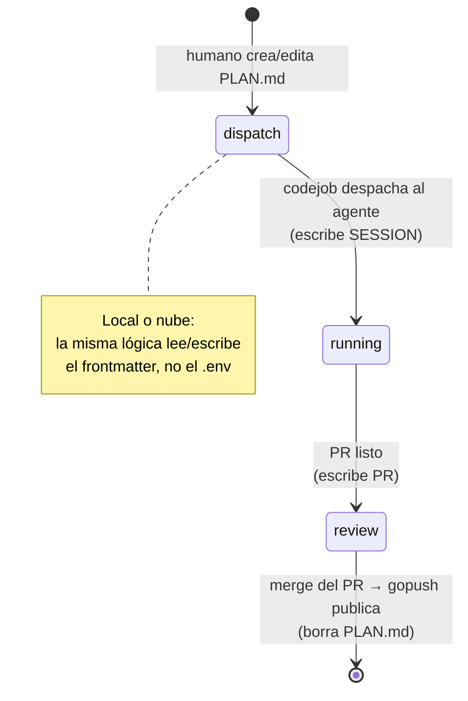
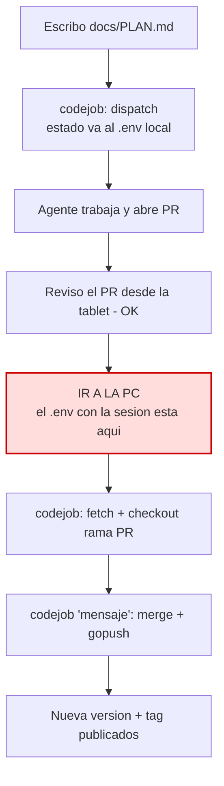

# Plan — Estado único en `docs/PLAN.md` y loop completo en la nube

## 1. Problema (justificación)

Hoy el estado de `codejob` está **repartido en dos lugares**:

- **`.env`** → la sesión activa: `CODEJOB=jules:running:SESSION_ID` /
  `jules:review:PR_URL`. Es **efímero, local y gitignored**.
- **`docs/PLAN.md`** → la tarea + frontmatter (`PLAN`, `TAG`). Además, durante la
  revisión se renombra a `docs/CHECK_PLAN.md` (también gitignored).

Consecuencia: el ciclo (dispatch → poll → review → publish) **solo puede vivir en
la PC**, porque el `.env` con la sesión nunca sale del disco local. Un runner de
la nube es efímero y arranca sin ese estado, así que no puede continuar el loop.
El flujo típico obliga a ir a la PC a ejecutar `codejob` dos veces (posicionar la
rama y luego fusionar+publicar) aunque la revisión ya se hizo desde el móvil.

**Objetivo:** mover **todo** el estado al **frontmatter de `docs/PLAN.md`** y dejar
de usar `.env`. Como el frontmatter se commitea, cada transición queda en git y el
loop entero se puede ejecutar en la nube:

> Fusiono el PR desde el móvil → se publica.
> Edito la cabecera de `docs/PLAN.md`, hago commit → se despacha el siguiente
> trabajo. **Sin abrir la PC en ningún momento.**

## 2. Propuesta (tres piezas)

1. **Estado único en el frontmatter** (§3) — retirar `.env` y `CHECK_PLAN.md`.
2. **Modo `codejob --ci`** (§6) — ejecución no interactiva que la Action invoca:
   lee el frontmatter, ejecuta la fase que corresponda y **escribe el nuevo estado
   de vuelta en el frontmatter** (commit).
3. **`codejob --init-action`** (§6) — genera `.github/workflows/codejob.yml` y
   registra los secrets con **la misma nomenclatura del keyring** (§3.3).

## 3. Modelo de estado — fuente única en el frontmatter

### 3.1 Claves del frontmatter

```markdown
---
PLAN: "feat: lo que implementa este plan"   # requerido — mensaje de commit al cerrar
TAG: v0.5.0                                  # opcional  — versión (omitido = auto-bump)
AGENT: jules                                 # opcional  — driver (default: jules)
STATUS: dispatch                             # gestionado por la máquina
SESSION: sessions/abc123                     # gestionado — set en 'running'
PR: https://github.com/o/r/pull/7            # gestionado — set en 'review'
---
```

| Clave | Quién la escribe | Significado |
|---|---|---|
| `PLAN` | humano | Mensaje de commit del cierre (requerido). |
| `TAG` | humano | Versión explícita (opcional). |
| `AGENT` | humano | Driver a usar (`jules` por defecto). |
| `STATUS` | máquina | `dispatch` → `running` → `review`. |
| `SESSION` | máquina | ID de sesión del agente (fase `running`). |
| `PR` | máquina | URL del PR abierto por el agente (fase `review`). |

`STATUS: dispatch` (o `STATUS` ausente) = "pendiente de despachar", exactamente el
mismo criterio que hoy es "no hay `CODEJOB` en `.env` y existe `PLAN.md`". El valor
es **derivable** de `SESSION`/`PR`, pero mantenerlo explícito hace el *gate* de la
Action trivial y legible por un humano.

### 3.2 Máquina de estados (cada arista es un commit)



- **dispatch → running:** `codejob` (local **o** `--ci` en la nube) envía el plan
  al `AGENT`, guarda `STATUS: running` + `SESSION`, commitea.
- **running → review:** al detectar el PR, guarda `STATUS: review` + `PR`, commitea.
- **review → cerrado:** al fusionar el PR se publica (`gopush`, tag-only) y se
  **borra `docs/PLAN.md`** (el commit de cierre usa el mensaje de `PLAN:`).

### 3.3 Nomenclatura del token (requisito explícito)

El nombre del secret del agente en GitHub **deriva del nombre del keyring local**,
para que sea el mismo identificador en ambos entornos:

```
secret_de_actions = strings.ToUpper(clave_del_keyring)
```

| Uso | Keyring local (servicio `devflow`) | Secret de GitHub Actions |
|---|---|---|
| Agente (Jules) | `jules_api_key` | `JULES_API_KEY` |
| PAT de GitHub  | `github_pat`   | `GITHUB_PAT` |

- `codejob --init-action` **lee** `jules_api_key` del keyring y lo registra como
  secret `JULES_API_KEY` con el `GitHub.SetSecret` que ya existe.
- `codejob --ci` **lee** la clave del agente desde la variable de entorno
  `JULES_API_KEY` (y cae al keyring cuando corre en local). Una única fuente de
  nombre en keyring y nube.

### 3.4 Qué se retira

- **`.env` para estado de codejob:** devflow deja de leer/escribir la clave
  `CODEJOB`. (No borramos el `.env` del usuario; solo dejamos de tocarlo.)
- **`docs/CHECK_PLAN.md`:** ya no hace falta el renombrado — `STATUS: review`
  marca la fase de revisión. Se elimina también el truco `.gitignore CHECK_*.md`.

### 3.5 Migración

Repos con `CODEJOB=...` en `.env` (incluido el formato legacy): en la siguiente
corrida, `codejob` migra ese estado al frontmatter (`STATUS`/`SESSION`/`PR`) y
borra la clave del `.env`. Reutiliza la lógica de migración que ya existe en
`LoadCodejobState`.

## 4. Disparo de las Actions (revisado sobre el estado unificado)

Con el estado en el frontmatter, el *gate* de cada Action es leer `STATUS`:

| Evento GitHub | Guard | Acción |
|---|---|---|
| `push` a la rama base que toca `docs/PLAN.md` | `STATUS == dispatch` | **Despachar** al agente (`codejob --ci`). Requiere `JULES_API_KEY`. |
| `pull_request` abierto por el agente | `STATUS == running` y el PR corresponde a `SESSION` | Escribir `STATUS: review` + `PR`. |
| `pull_request` `closed` + `merged == true` | `STATUS == review` y `PLAN.md` presente | **Publicar** (`gopush`, tag-only), borrar `PLAN.md`. |

**Exclusión mutua sin locks:** el gate de publicación exige `STATUS == review` con
`PLAN.md` presente. Si el cierre se hizo en la PC (`codejob 'msg'` ya publicó y
borró `PLAN.md`), la Action encuentra el archivo ausente y hace *no-op*. Nube y PC
siguen siendo mutuamente excluyentes, ahora con una señal más precisa que "el
archivo existe": el propio `STATUS`.

## 5. Diagramas

### 5.1 Flujo actual (el cuello de botella)



### 5.2 Flujo propuesto (loop completo en la nube)


Todo ocurre sin tocar la PC: editar/commitear despacha; fusionar publica.

## 6. Alcance de la implementación

### 6.1 Estado en el frontmatter

- `frontmatter.go` — extender `PlanMeta` con `Agent`, `Status`, `Session`, `PR`;
  añadir constantes de clave y un **escritor** que actualice solo el bloque de
  frontmatter preservando el cuerpo (hoy `tinywasm/markdown` solo lo lee).
- `codejob.go` / `codejob_state.go` — sustituir la lectura/escritura de `.env`
  (`LoadCodejobState`/`SaveCodejobState`) por operaciones sobre el frontmatter;
  añadir la migración desde `.env` (§3.5) y eliminar el renombrado a
  `CHECK_PLAN.md` (`HandleDone`, `MergeAndPublish`, `.gitignore`).
- `codejob_auth.go` — permitir que el agente lea la clave desde la variable de
  entorno `JULES_API_KEY` (nombre = `ToUpper` del keyring), cayendo al keyring.

### 6.2 Modos de CLI y Action

- `codejob --ci` — orquestador no interactivo para el runner: lee `STATUS` del
  frontmatter y ejecuta la fase (dispatch / sync-PR / publish), escribiendo el
  nuevo estado de vuelta y commiteando. Publica con `gopush` **tag-only** (sin
  `gorelease`).
- `codejob --init-action` — crea `.github/workflows/codejob.yml` (idempotente,
  `--force` sobreescribe) y registra el secret `JULES_API_KEY` desde el keyring.
- `cli.go` — parsear `--ci`, `--init-action`, `--force`.
- `cmd/codejob/main.go` — atender los nuevos flags y actualizar `showHelp()`.

### 6.3 Workflow (decisiones ya acordadas)

- **Runner `ubuntu-latest`, no Alpine.** No existe `runs-on: alpine`; Alpine-en-
  contenedor es más lento y no ahorra costo (facturación por minuto-runner), y
  `gh`/`git`/gcc vienen preinstalados. La carga real es `go install` + `gotest`
  (con race detector, que quiere cgo/gcc y es problemático bajo musl). Alpine solo
  aporta como imagen de despliegue, algo ortogonal.
- **Bootstrap `go install` pinneado** (no binario descargado): como el flujo es
  `gopush` tag-only (sin `gorelease`), los releases no llevan assets binarios que
  descargar. `go install ...cmd/codejob@vX.Y.Z` fijado a versión es el bootstrap
  correcto (Go ya está para `gotest`).
- **Docs:** actualizar `docs/CODEJOB.md` y `docs/diagrams/CODEJOB_FLOW.md`.

## 7. Pruebas (test map)

| Comportamiento | Test |
|---|---|
| Leer estado (`STATUS`/`SESSION`/`PR`) del frontmatter | `TestPlanState_Read` |
| Escribir estado preservando el cuerpo del `PLAN.md` | `TestPlanState_WritePreservesBody` |
| Migración `.env CODEJOB` → frontmatter (incl. legacy) | `TestPlanState_MigrateFromEnv` |
| Nomenclatura: secret = `ToUpper(clave_keyring)` | `TestSecretName_FromKeyringKey` |
| `--ci` en `dispatch` despacha y escribe `running` | `TestCI_DispatchTransition` |
| `--ci` en `review` publica (tag-only) y borra `PLAN.md` | `TestCI_PublishTransition` |
| `--ci` publica es no-op si `PLAN.md` ausente | `TestCI_NoopWhenNoPlan` |
| `--init-action` crea el workflow (idempotente/`--force`) | `TestInitCodejobAction_*` |

## 8. Riesgos y decisiones abiertas (para tu aprobación)

1. **Estado commiteado en el historial.** `SESSION`/`PR` quedan en git para
   siempre. No son secretos (el PR URL es público; el session ID es un
   identificador), pero es ruido en el historial. ¿Aceptable? (Alternativa:
   comprimir las transiciones intermedias, pero perderíamos la trazabilidad.)
2. **Conflictos de edición.** Máquina y humano escriben el mismo archivo. Mitigación:
   la máquina toca **solo** el bloque de frontmatter; el humano, el cuerpo. ¿Ok?
3. **Poll de `running` en la nube.** La transición `running → review` necesita saber
   cuándo el agente terminó. Propongo dispararla por el evento `pull_request opened`
   del agente (cero polling). Alternativa: un `schedule` (cron) que sondee. ¿Cuál
   prefieres?
4. **Despacho encadenado en la nube.** Con `JULES_API_KEY` como secret, el despacho
   automático ya es posible en CI (era el único bloqueo). ¿Lo habilito de una vez o
   lo dejo tras una bandera para estrenarlo con cuidado?
5. **Cascade/backup en CI.** Asumen entorno local; propongo `--no-cascade` y sin
   backup en el runner (publicar solo el módulo), dejando el cascade al flujo local.

## 9. Resumen

Consolidar todo el estado de `codejob` en el frontmatter de `docs/PLAN.md`
(`STATUS`/`SESSION`/`PR` junto a `PLAN`/`TAG`/`AGENT`) y retirar `.env` y
`CHECK_PLAN.md`. Como cada transición es un commit, el loop completo —despachar,
sincronizar el PR y publicar— se ejecuta en la nube: editar la cabecera y commitear
despacha; fusionar el PR publica. El secret del agente reutiliza el nombre del
keyring (`jules_api_key` → `JULES_API_KEY`), manteniendo un único identificador en
local y en la nube. Nada de esto requiere abrir la PC.
