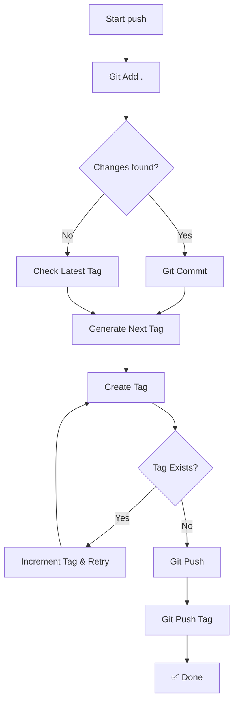

# push

Git workflow automation: add, commit, tag, push.

## Usage

```bash
push "commit message"              # Auto-generated tag
push "commit message" "v1.0.0"     # Specific tag
```

## What it does

1. `git add .`
2. `git commit -m "message"`
3. Creates or uses tag (auto-increments patch version)
4. `git push` and `git push origin <tag>`
5. Sets upstream if needed



## Output

```
✅ Tag: v1.0.1, ✅ Pushed ok
```

**Tag already exists:**
```
Tag warning: tag v1.0.1 already exists, ✅ Pushed ok
```

## Tag auto-generation

- Finds latest tag (e.g., `v1.0.5`)
- Increments patch: `v1.0.6`
- If no tags exist: `v0.0.1`

## Exit codes

- `0` - Success
- `1` - Git operation failed

## Note: Special characters

Use **single quotes** for messages with backticks or `$`:
```bash
push 'feat: Add `afterLine` parameter'
```
