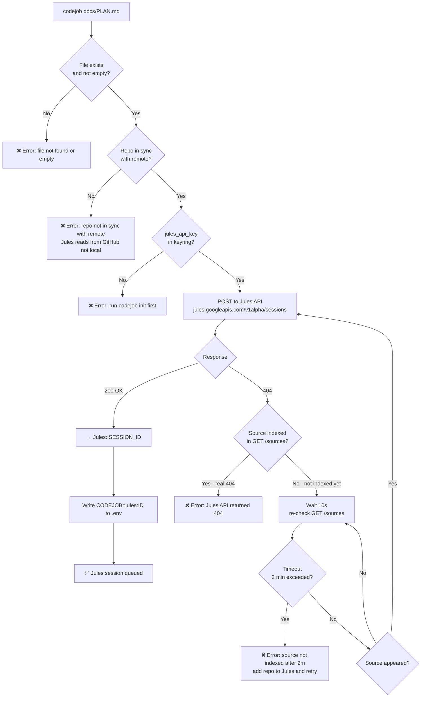

# CodeJob Dispatch Flow

## Local — `codejob [path]`

```mermaid
flowchart TD
    A[codejob docs/PLAN.md] --> B{File exists<br/>and not empty?}
    B -->|No| BE[❌ Error: file not found or empty]
    B -->|Yes| GIT{Repo in sync<br/>with remote?}
    GIT -->|No| GITE[❌ Error: repo not in sync with remote<br/>Jules reads from GitHub not local]
    GIT -->|Yes| C{jules_api_key<br/>in keyring?}
    C -->|No| CE[❌ Error: run codejob init first]
    C -->|Yes| D[POST to Jules API<br/>jules.googleapis.com/v1alpha/sessions]
    D --> F{Response}
    F -->|200 OK| G[→ Jules: SESSION_ID]
    G --> SAVE[Write CODEJOB=jules:ID to .env]
    SAVE --> DONE[✅ Jules session queued]
    F -->|404| SV{Source indexed<br/>in GET /sources?}
    SV -->|Yes - real 404| REAL[❌ Error: Jules API returned 404]
    SV -->|No - not indexed yet| POLL[Wait 10s<br/>re-check GET /sources]
    POLL --> TM{Timeout<br/>2 min exceeded?}
    TM -->|Yes| TME[❌ Error: source not indexed after 2m<br/>add repo to Jules and retry]
    TM -->|No| SV2{Source appeared?}
    SV2 -->|No| POLL
    SV2 -->|Yes| D
```

