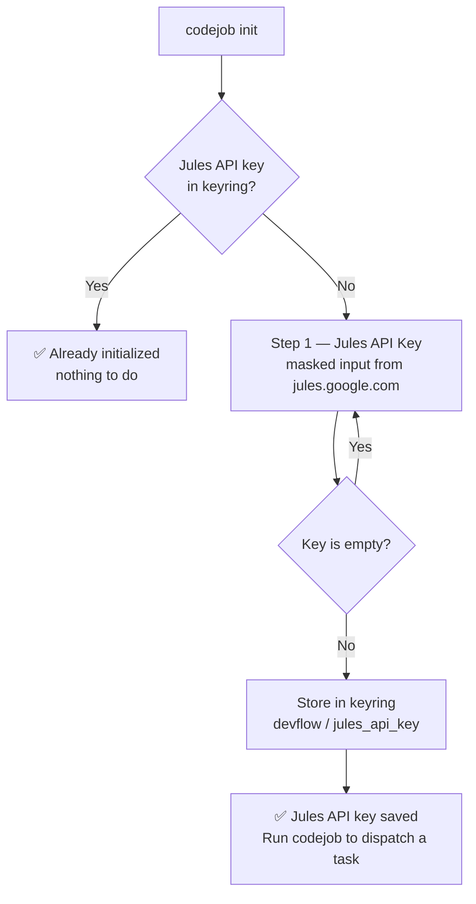

# CodeJob Init Flow

```mermaid
flowchart TD
    A[codejob init] --> B{Jules API key<br/>in keyring?}
    B -->|Yes| C[✅ Already initialized<br/>nothing to do]
    B -->|No| D[Step 1 — Jules API Key<br/>masked input from jules.google.com]
    D --> E{Key is empty?}
    E -->|Yes| D
    E -->|No| F[Store in keyring<br/>devflow / jules_api_key]
    F --> G[✅ Jules API key saved<br/>Run codejob to dispatch a task]
```
