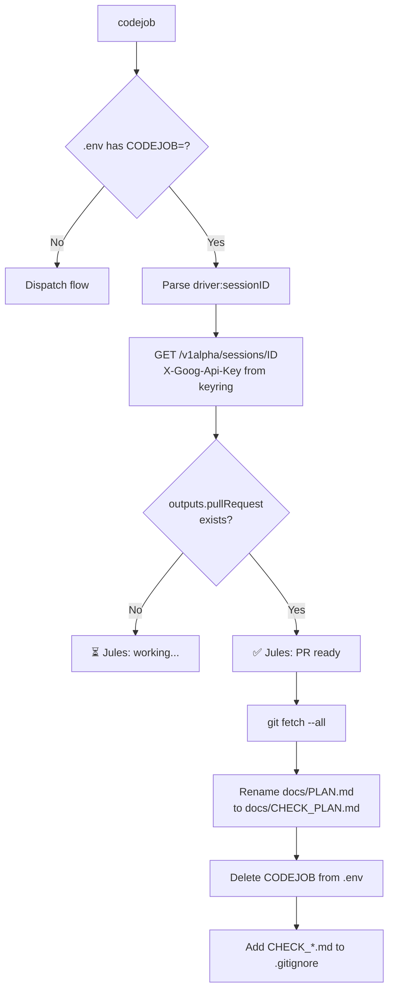

```mermaid
flowchart TD
    A[codejob] --> B{.env has CODEJOB=?}
    B -->|No| C[Dispatch flow]
    B -->|Yes| D[Parse driver:sessionID]
    D --> E[GET /v1alpha/sessions/ID<br/>X-Goog-Api-Key from keyring]
    E --> F{outputs.pullRequest<br/>exists?}
    F -->|No| G[⏳ Jules: working...]
    F -->|Yes| H[✅ Jules: PR ready]
    H --> I[git fetch --all]
    I --> J[Rename docs/PLAN.md<br/>to docs/CHECK_PLAN.md]
    J --> K[Delete CODEJOB from .env]
    K --> L[Add CHECK_*.md to .gitignore]
```
