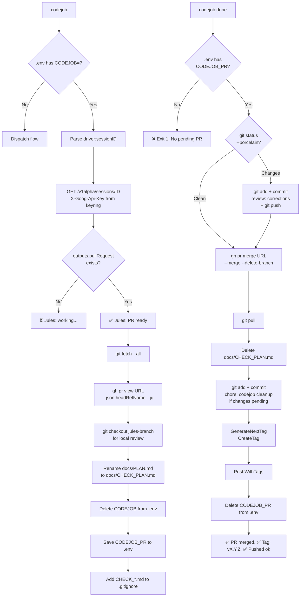

```mermaid
flowchart TD
    A[codejob] --> B{.env has CODEJOB=?}
    B -->|No| C[Dispatch flow]
    B -->|Yes| D[Parse driver:sessionID]
    D --> E[GET /v1alpha/sessions/ID<br/>X-Goog-Api-Key from keyring]
    E --> F{outputs.pullRequest<br/>exists?}
    F -->|No| G[⏳ Jules: working...]
    F -->|Yes| H[✅ Jules: PR ready]
    H --> I[git fetch --all]
    I --> BRANCH[gh pr view URL<br/>--json headRefName --jq]
    BRANCH --> CHECKOUT[git checkout jules-branch<br/>for local review]
    CHECKOUT --> J[Rename docs/PLAN.md<br/>to docs/CHECK_PLAN.md]
    J --> K[Delete CODEJOB from .env]
    K --> L[Save CODEJOB_PR to .env]
    L --> M[Add CHECK_*.md to .gitignore]

    DONE[codejob done] --> PR_CHECK{.env has<br/>CODEJOB_PR?}
    PR_CHECK -->|No| ERROR[❌ Exit 1: No pending PR]
    PR_CHECK -->|Yes| DIRTY{git status<br/>--porcelain?}
    DIRTY -->|Changes| COMMIT_PRE[git add + commit<br/>review: corrections<br/>+ git push]
    DIRTY -->|Clean| MERGE
    COMMIT_PRE --> MERGE[gh pr merge URL<br/>--merge --delete-branch]
    MERGE --> PULL[git pull]
    PULL --> DEL[Delete docs/CHECK_PLAN.md]
    DEL --> COMMIT[git add + commit<br/>chore: codejob cleanup<br/>if changes pending]
    COMMIT --> TAG[GenerateNextTag<br/>CreateTag]
    TAG --> PUSH[PushWithTags]
    PUSH --> CLEAN[Delete CODEJOB_PR from .env]
    CLEAN --> RESULT[✅ PR merged, ✅ Tag: vX.Y.Z, ✅ Pushed ok]
```
