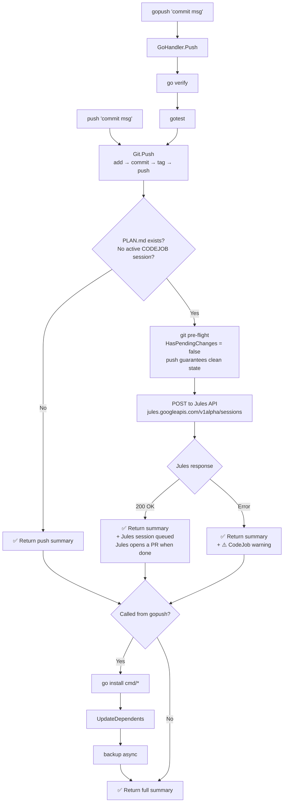

# push / gopush + CodeJob Integrated Flow

## Overview

When `docs/PLAN.md` exists, both `push` and `gopush` automatically dispatch the task
to Jules after a successful push. No separate `codejob` invocation is needed.

CodeJob dispatch is embedded inside `Git.Push()`, making it **project-type agnostic**:
any caller of `git.Push()` — CLI or library — triggers CodeJob automatically.

## Why the pre-flight always passes

`CodeJob.Send()` calls `git.HasPendingChanges()` before dispatching.
After `git.Push()` completes:

- `git status --porcelain` → empty (all changes committed)
- `IsAheadOfRemote()` → false (just pushed)

There is no race condition — `Git.Push()` is synchronous.

## Why dispatch is inside Git.Push() (not in GoHandler or CLI)

Previously CodeJob lived in `go_handler.Push()` (step 8), which meant:
- `push` CLI (bare git push for any project) → **no CodeJob** ❌
- Library callers of `git.Push()` → **no CodeJob** ❌

Moving it into `Git.Push()` makes CodeJob project-type agnostic:
any project using `push` or `gopush` gets automatic CodeJob dispatch.

Errors from dispatch are included in the `PushResult.Summary` (visible to all callers)
instead of being silently swallowed.
