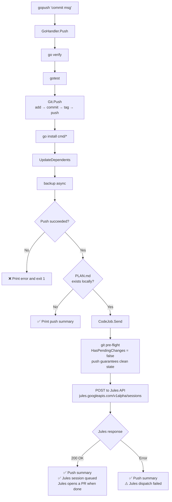

# gopush + CodeJob Integrated Flow

## Overview

When `docs/PLAN.md` exists, `gopush` automatically dispatches the task
to Jules after a successful push. No separate `codejob` invocation is needed.

## Why the pre-flight always passes after gopush

`CodeJob.Send()` calls `git.HasPendingChanges()` before dispatching.
After `gopush` completes successfully:

- `git status --porcelain` → empty (all changes committed)
- `IsAheadOfRemote()` → false (just pushed)

There is no race condition — `GoHandler.Push()` is synchronous.
