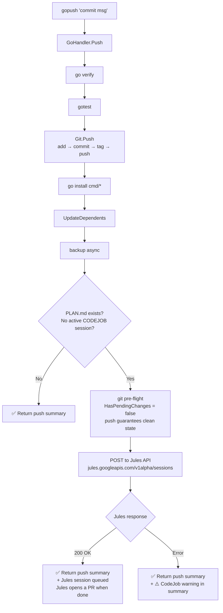

# gopush + CodeJob Integrated Flow

## Overview

When `docs/PLAN.md` exists, `gopush` automatically dispatches the task
to Jules after a successful push. No separate `codejob` invocation is needed.

CodeJob dispatch is embedded inside `GoHandler.Push()` (step 8), so it runs
regardless of whether the caller is the `gopush` CLI or a library consumer.

## Why the pre-flight always passes

`CodeJob.Send()` calls `git.HasPendingChanges()` before dispatching.
After step 3 (`git.Push()`) completes:

- `git status --porcelain` → empty (all changes committed)
- `IsAheadOfRemote()` → false (just pushed)

There is no race condition — `GoHandler.Push()` is synchronous.

## Why dispatch is inside GoHandler.Push() (not in the CLI)

Previously `TryDispatch` was called only in the `cmd/gopush` and `cmd/push` CLI entry
points. This meant that library consumers calling `goHandler.Push()` directly would
never trigger CodeJob. Embedding the dispatch as step 8 of `GoHandler.Push()` ensures
the behavior is consistent regardless of the call site.

Errors from dispatch are now included in the Push summary string (visible to all callers)
instead of being silently swallowed.
