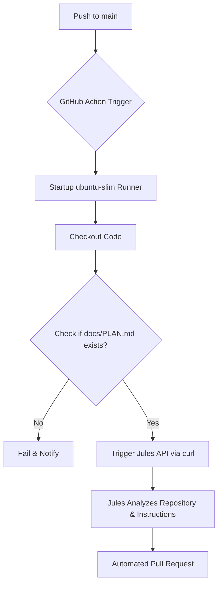

```mermaid
graph TD
    A[Push to main] --> B{GitHub Action Trigger}
    B --> C[Startup ubuntu-slim Runner]
    C --> D[Checkout Code]
    D --> E{Check if docs/PLAN.md exists?}
    E -- No --> F[Fail & Notify]
    E -- Yes --> G[Trigger Jules API via curl]
    G --> H[Jules Analyzes Repository & Instructions]
    H --> I[Automated Pull Request]
```
