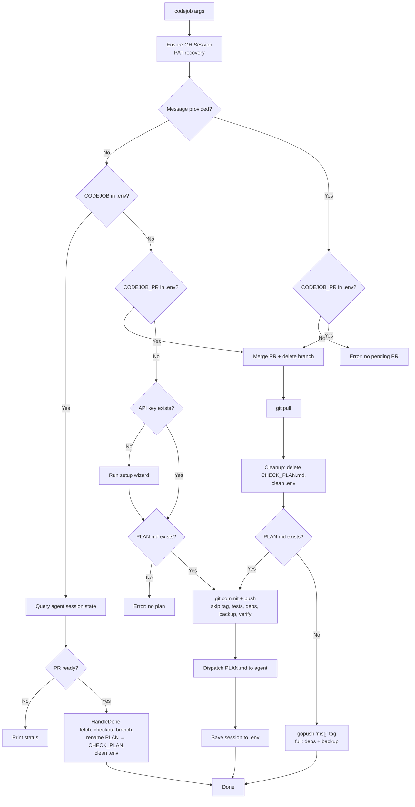

# codejob Flow

Orchestrator for dispatching coding tasks to external AI agents and closing the loop.



## Usage

```bash
codejob                        # dispatch PLAN.md or check session status
codejob 'commit message'       # close loop: merge PR, publish, auto-tag
codejob 'commit message' v1.0  # close loop with specific tag
```
