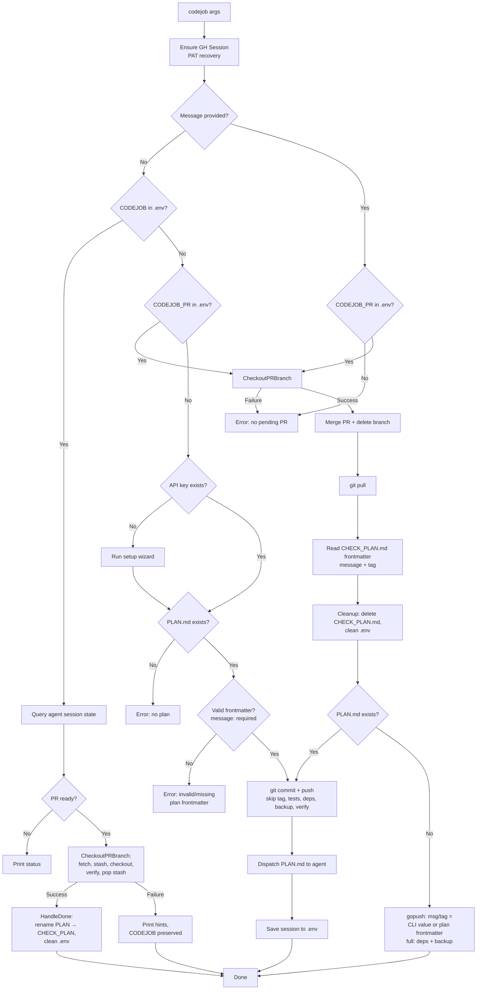

# codejob Flow

Orchestrator for dispatching coding tasks to external AI agents and closing the loop.



The close-loop commit message is **not** hardcoded: it comes from the finished
plan's `CHECK_PLAN.md` frontmatter (`message:`, optional `tag:`), unless an
explicit CLI value overrides it. Because dispatch (`IV`) rejects a `PLAN.md`
without valid frontmatter, the message always exists by the time the loop closes
— the old generic `chore: merge agent PR` no longer occurs.

## Traceability (Test Map)

| Diagram Edge / Branch | Test Name |
|---|---|
| CheckoutPRBranch: stash/pop success | `TestCheckoutPRBranch_DirtyTreeSuccess` |
| CheckoutPRBranch: pop conflict | `TestCheckoutPRBranch_PopConflict` |
| HandleDone: Success path | `TestHandleDone_HappyPath` |
| HandleDone: Failure path (retryable) | `TestHandleDone_Retryability` |
| MergeAndPublish: Checkout failure | `TestMergeAndPublish_Guard` |
| Dispatch rejects invalid plan frontmatter (`IV -- No`) | `test/codejob_test.go` |
| Close-loop message = plan frontmatter unless CLI override | `TestResolvePublishMessage_*` (`test/merge_message_test.go`) |

## Plan frontmatter

Every `docs/PLAN.md` must start with a frontmatter block; `message` is required
and becomes the close-loop commit message, `tag` is optional:

```markdown
---
message: "feat: topological dependency cascade and dirty-tree guard"
tag: v0.4.41
---
```

## Usage

```bash
codejob                        # dispatch PLAN.md, or check status / auto-merge a pending PR
                               #   (close-loop message taken from the plan frontmatter)
codejob 'commit message'       # close loop with an explicit message override
codejob 'commit message' v1.0  # close loop with explicit message + tag override
```
