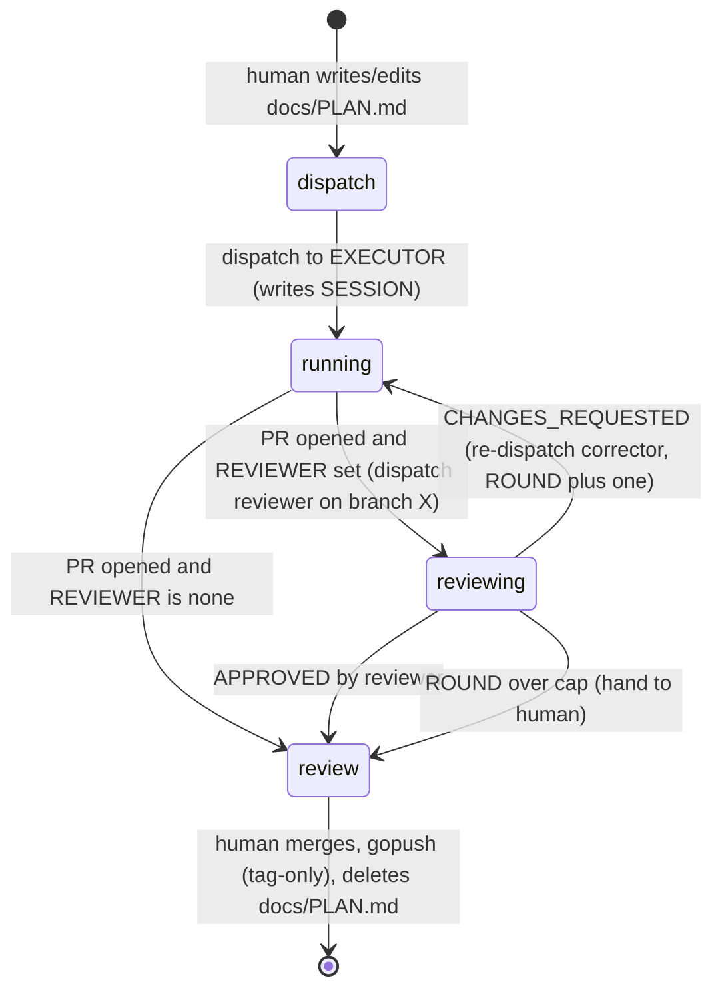
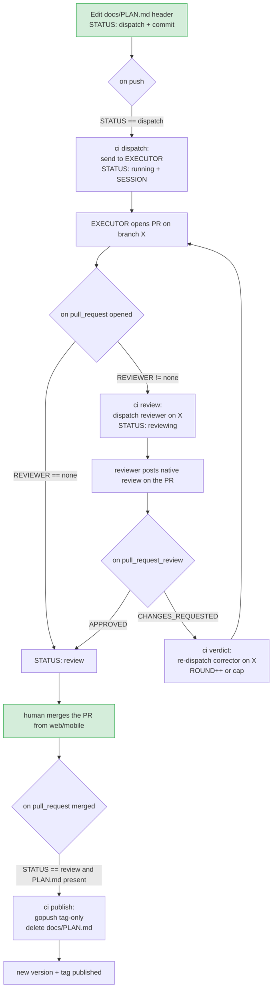

# codejob Flow

Orchestrator for dispatching a coding task to external AI agents and closing the
loop. All state lives in the frontmatter of `docs/PLAN.md` (there is no `.env`
state and no `CHECK_PLAN.md`), so every transition is a git commit and the whole
loop can run either locally or in GitHub Actions.

See also: [CODEJOB.md](../CODEJOB.md).

## State machine

`STATUS` in the plan frontmatter is the single source of truth. Each edge is a
commit written by `codejob` (locally or via `codejob --ci`).



## Cloud loop (GitHub Actions)

The workflow `.github/workflows/codejob.yml` maps each GitHub event to a phase of
`codejob --ci`. Commits are pushed with the `GH_TOKEN` PAT so they trigger the
next workflow (commits made with the default `GITHUB_TOKEN` do not).



Local flow is identical but driven by running `codejob` yourself instead of the
Action; both share the same frontmatter state and the same phase functions.

## Event guards

Events do not carry the agent session id, so correlation is by identity/branch,
not by `SESSION`:

| Event | Guard |
|---|---|
| `push` | `STATUS == dispatch` and `docs/PLAN.md` valid |
| `pull_request` opened | `STATUS == running` and PR head is the tracked branch |
| `pull_request_review` | `STATUS == reviewing` and review author is the REVIEWER identity |
| `pull_request` closed | `merged == true` and `STATUS == review` and `docs/PLAN.md` present |

## Traceability (Test Map)

Every edge/guard is covered by a mock-based test (no real network, git, gh or
keyring):

| Edge / Behavior | Test | Mock used |
|---|---|---|
| Read frontmatter state | `TestPlanState_ReadFrontmatter` | temp file |
| Write state, preserve body | `TestPlanState_WritePreservesBody` | temp file |
| `STATUS` derived when absent | `TestPlanState_StatusDerivation` | temp file |
| Token read: env then keyring, same name | `TestAuth_EnvVarThenKeyring` | fake keyring/env |
| dispatch → running | `TestCI_Dispatch_WritesRunning` | fake driver + runner |
| running → reviewing (REVIEWER set) | `TestCI_PROpened_DispatchesReviewer` | fake driver + runner |
| running → review (REVIEWER none) | `TestCI_PROpened_NoReviewer` | fake runner |
| reviewing → review (APPROVED) | `TestCI_Verdict_Approved` | fake runner (review json) |
| reviewing → running (CHANGES_REQUESTED) | `TestCI_Verdict_ChangesRequested_RoundInc` | fake driver + runner |
| reviewing → review (ROUND > N) | `TestCI_Verdict_RoundCap` | fake runner |
| review → published (tag-only, delete plan) | `TestCI_Publish_TagOnly` | mock Publisher |
| publish no-op when plan absent | `TestCI_Publish_NoopWhenNoPlan` | mock Publisher |
| workflow scaffold idempotent/force | `TestInitAction_*` | temp dir |
| secret register repo/org | `TestInitAction_SecretScope` | mock SecretRunner |
| workflow template contract | `TestActionTemplate_Contract` | embedded string |

## Plan frontmatter

Every `docs/PLAN.md` must start with a frontmatter block; `PLAN` is required (it
becomes the close-loop commit message). Full key reference in
[CODEJOB.md](../CODEJOB.md#frontmatter).

```markdown
---
PLAN: "feat: what this plan implements"
TAG: v0.2.0
EXECUTOR: jules
REVIEWER: none
---
```

## Usage

```bash
codejob                 # local: run the phase implied by the current STATUS
codejob --init-action   # scaffold .github/workflows/codejob.yml + register secrets
```

In the cloud the workflow calls `codejob --ci <phase>` (`dispatch`, `review`,
`verdict`, `publish`); you never call `--ci` by hand.
