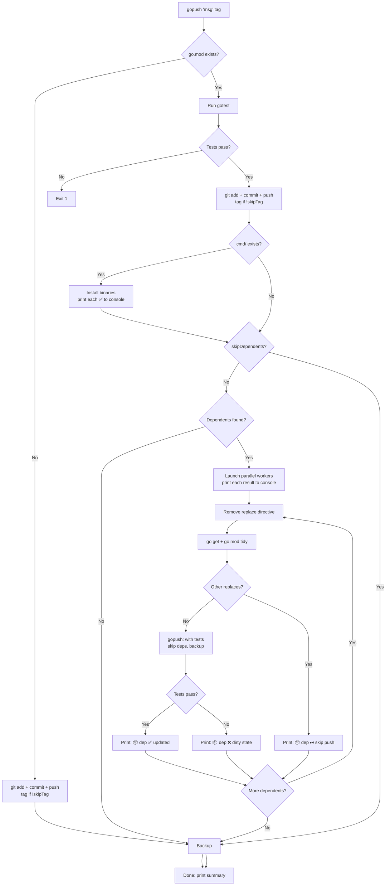

# gopush Flow

Universal build+publish pipeline. Detects `go.mod` to choose between plain git push or full Go workflow.



## Output behavior

### Real-time console output (streaming, as each completes)

**Install** prints a single summary line:
```
✅ Installed: gotest, gopush, codejob
```

**Dependents** print one line per dependent (result only):
```
📦 deploy → skip (other replaces) ⏭
📦 mylib → updated ✅
📦 otherlib → tests failed ❌
```

### Final summary (single line, main package only)

The summary does NOT include install details or dependent results:
```
vet ✅, race ✅, tests ✅, coverage: 52.7%, Tag: v1.2.3, Pushed ✅, Backup ✅
```
