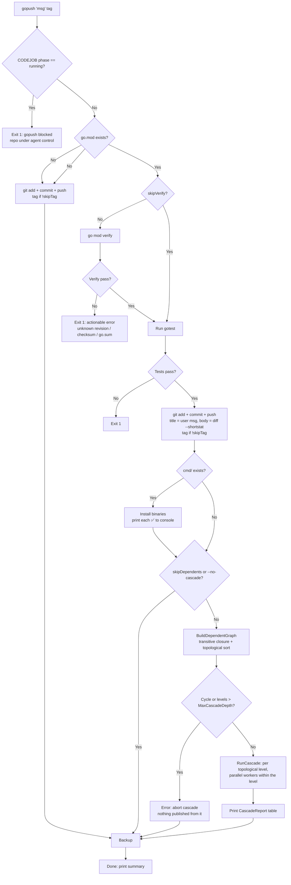
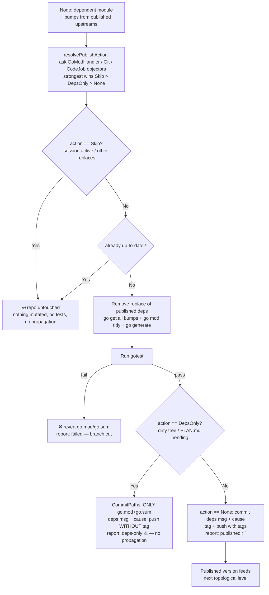

# gopush Flow

Universal build+publish pipeline. Detects `go.mod` to choose between plain git
push or the full Go workflow. Dependents are updated through a **transitive
cascade coordinator** (topological order, one commit+tag per module per wave).

> **Target flow.** The executable contract lives in the test suite — each
> diagram section links the tests that lock it. Implementation must make those
> tests pass without changing their expectations.

## Contract → tests

| Contract | Locked by |
|---|---|
| Dirty-guard per node: pathspec-limited commit (`go.mod`+`go.sum` only), no tag, never `git add .`/`-A` | [`TestUpdateDependentModule_DirtyTreeCommitsOnlyGoModAndSum`](../../test/dependents_guard_test.go) |
| Git primitives: `StatusPorcelain`, `CommitPaths`, `DiffShortStat` (diff vs HEAD, staged or not), `WorkTreeDirtyBeyond` | [`test/dependents_guard_test.go`](../../test/dependents_guard_test.go) |
| Graph: transitive closure, topological order, single node per module, cycle = error, `MaxCascadeDepth = 10` | [`TestBuildDependentGraph_*`](../../test/cascade_test.go) |
| Wave semantics: one call per node with ALL published bumps, failure cuts only its branch, partial updates allowed, deps-only does not propagate, skipped when zero bumps | [`TestRunCascade_*`](../../test/cascade_test.go) |
| Publish-objector chain: existing managers (`GoModHandler`/`Git`/`CodeJob`) implement `ObjectsToPublish`; strongest action wins (`Skip > DepsOnly > None`); `PLAN.md` pending → deps-only | [`test/publish_objector_test.go`](../../test/publish_objector_test.go) |
| Deps commit format: `deps:` title, `cause:` line propagating the root message, bump list | [`TestBuildDepsCommitMessage`](../../test/commit_message_test.go) |
| Root push: user title intact + `--shortstat` body | [`TestGoPush_AppendsShortStatBody`](../../test/go_handler_test.go) |
| `UpdateDependentModule` carries `rootCause` (4th parameter) | [`TestUpdateDependentModule`](../../test/go_handler_test.go) |
| Active session protection: `UpdateDependentModule` does NOT touch the repo at all | [`TestUpdateDependentModule_ActiveSessionLeavesRepoUntouched`](../../test/dependents_guard_test.go) |
| Other replaces protection: `UpdateDependentModule` does NOT touch the repo at all | [`TestUpdateDependentModule_OtherReplacesLeavesRepoUntouched`](../../test/dependents_guard_test.go) |
| Up-to-date protection: `UpdateDependentModule` does NOT touch the repo at all | [`TestUpdateDependentModule_UpToDateLeavesRepoUntouched`](../../test/dependents_guard_test.go) |
| `RunCascade` blinda el tag rancio: un nodo saltado o deps-only no propaga nada | [`TestRunCascade_SkippedNodeDoesNotPropagate`](../../test/cascade_test.go) |
| `Go.Push` bloqueado por sesión `CODEJOB` activa | [`TestGoPush_BlockedOnRunningPhase`](../../test/go_handler_test.go) |
| Node result is a typed `CascadeOutcome`; status is never inferred from substrings | (Contractual type safety) |

## Main pipeline



- Shortstat body: computed **before** staging, so its contract is
  `git diff HEAD --shortstat` (staged or not) — a `--cached`-only
  implementation returns empty at message-build time
  ([`TestGitDiffShortStat`](../../test/dependents_guard_test.go)).
- Graph rules: cycles abort with an explicit error before anything is
  published; `MaxCascadeDepth = 10` topological levels
  ([`TestBuildDependentGraph_CycleIsAnError`, `TestBuildDependentGraph_DepthLimit`](../../test/cascade_test.go)).

## Per-node cascade processing

Each dependent node is processed **exactly once** per wave
([`TestRunCascade_DiamondProcessesNodeOnceWithAllBumps`](../../test/cascade_test.go)),
receiving the bumps of ALL its in-cascade dependencies published in this wave.
A node with zero available bumps (every upstream failed or published nothing)
is **skipped**; a node with some failed upstreams is still processed with the
bumps that did publish — partial updates are safe: the module simply stays on
the old version of the failed dependency
([`TestRunCascade_FailureCutsOnlyItsBranch`](../../test/cascade_test.go)).

Whether a node publishes is decided by a **publish-objector chain**: the go
publisher asks each domain manager "do you object to publishing this repo?" and
takes the strongest action (`Skip > DepsOnly > None`). No manager owns another's
concern — each existing manager implements `ObjectsToPublish` for its own domain
([`TestResolvePublishAction_*`](../../test/publish_objector_test.go)):

| Objector (existing manager) | Objects when | Action |
|---|---|---|
| `GoModHandler` | `go.mod` has other local `replace`s | `Skip` |
| `CodeJob` | active session (phase running or review) | `Skip` |
| `CodeJob` | a `docs/PLAN.md` is pending in the repo | `DepsOnly` |
| `Git` | worktree dirty beyond `go.mod`/`go.sum` (`.env`/`.gitignore` ignored) | `DepsOnly` |



Guard rails:

- **`git add .` (or `-A`, or any path beyond `go.mod`/`go.sum`) never runs on a
  dependent** — a `DepsOnly` node (dirty tree, e.g. WIP like `tinywasm/sse`, or a
  pending `docs/PLAN.md`) only ever gets a pathspec-limited
  `git add go.mod go.sum`. Developer WIP is never swept into a deps commit
  ([`TestUpdateDependentModule_DirtyTreeCommitsOnlyGoModAndSum`](../../test/dependents_guard_test.go)).
- The dirty objector (`Git`) uses `WorkTreeDirtyBeyond` — `.env` and `.gitignore`
  are always ignored, same rule as `HasPendingChanges`
  ([`TestWorkTreeDirtyBeyond`](../../test/dependents_guard_test.go)).
- **`Skip` nodes (active `CODEJOB` session, other replaces): the repo is NOT
  touched at all** — no `go.mod` write, no `go get`, no tests. Nothing propagates
  downstream.
- **A skipped or deps-only node never contributes a version** to the next
  topological level (it used to leak its stale tag as if freshly published).
- `DepsOnly` nodes run tests as a gate, then commit only `go.mod`/`go.sum` without
  a tag; nothing propagates (no new version). A repo with a pending `docs/PLAN.md`
  absorbs the bump but is not published, since incoming agent work will change it.
- **Commit message** is deterministic, built by `BuildDepsCommitMessage`
  ([`TestBuildDepsCommitMessage`](../../test/commit_message_test.go)):
  ```
  deps: update router to v0.1.3

  cause: feat: rutas con parámetros opcionales   ← root gopush message, propagated

  - github.com/tinywasm/router v0.1.2 → v0.1.3
  ```

## Output behavior

### Real-time console output (streaming, as each completes)

**Install** prints a single summary line:
```
✅ Installed: gotest, gopush, codejob
```

**Cascade nodes** print one line per node (result only):
```
📦 mylib → published v0.3.1 ✅
📦 sse → deps only (dirty tree) ⚠
📦 otherlib → tests failed ❌
📦 leaflib → skipped (no published upstreams) ⏭
```

### Cascade report (end of cascade)

```
📦 Cascade report
  mylib    → published v0.3.1 ✅
  sse      → deps only (dirty tree) ⚠
  otherlib → failed: tests ❌
  leaflib  → skipped (upstream failed) ⏭
```

### Final summary (single line, main package only)

The summary does NOT include install details or cascade results:
```
vet ✅, race ✅, tests ✅, coverage: 52.7%, Tag: v1.2.3, Pushed ✅, Backup ✅
```
