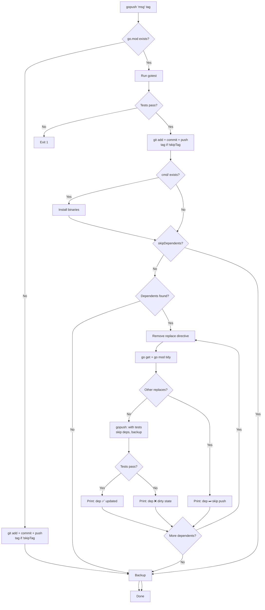

# gopush Flow

Universal build+publish pipeline. Detects `go.mod` to choose between plain git push or full Go workflow.



## Output behavior

**Dependents** print their result in real-time (one line per dependent):
```
📦 mylib → ✅ tests ok, updated to v1.2.3
📦 otherlib → ❌ tests failed (dirty state, manual fix required)
📦 anotherlib → ⏭ skip push (other replaces exist)
```

**Final summary** only reflects the main package:
```
✅ vet ok, ✅ tests ok, ✅ Tag: v1.2.3, ✅ Pushed ok
```
