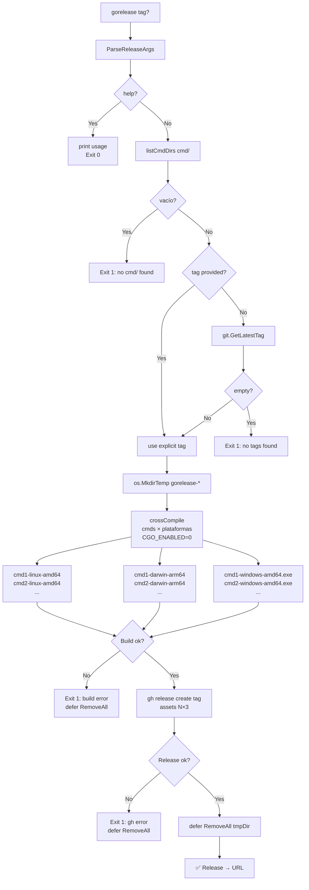
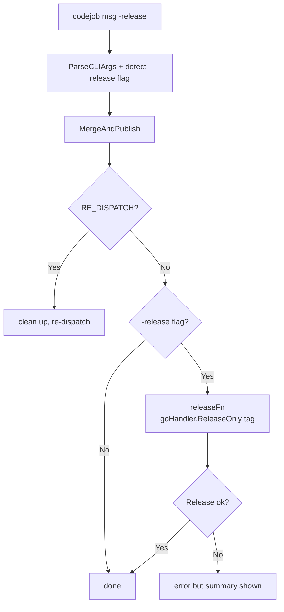

# gorelease Flow

Release-only workflow: reads an existing tag from git and creates a GitHub Release with
cross-compiled binaries. No tags are created, no commits made.



## Output

```
✅ Release → https://github.com/owner/repo/releases/tag/v0.2.13
```

## With codejob `-release` flag

`codejob 'msg' -release` runs the normal close-loop (gopush), then calls `gorelease`:



Tag creado por `gopush` en MergeAndPublish es usado inmediatamente por `gorelease`.
