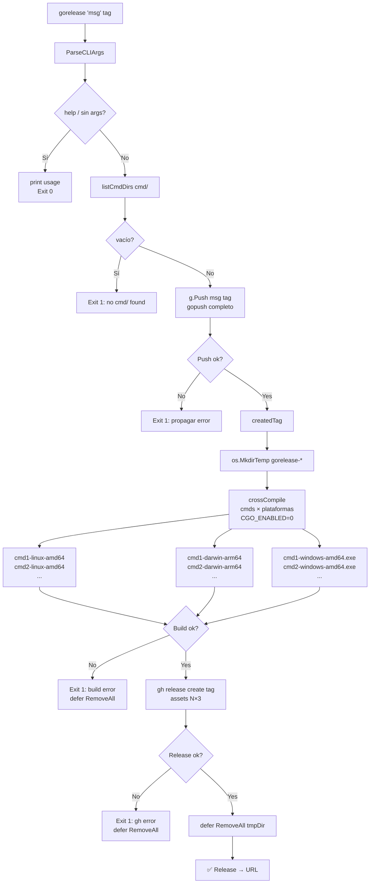

# gorelease Flow

Extensión de [GOPUSH_FLOW.md](GOPUSH_FLOW.md): corre el pipeline completo de gopush
y luego crea un GitHub Release con binarios cross-platform para todos los `cmd/`.



## Output

```
vet ✅, race ✅, tests ✅, coverage: 71%, Tag: v0.2.13, Pushed ✅, Backup ✅
✅ Release → https://github.com/tinywasm/goflare/releases/tag/v0.2.13
```

Tag ya aparece en la primera línea (gopush summary) — no se repite en la segunda.
