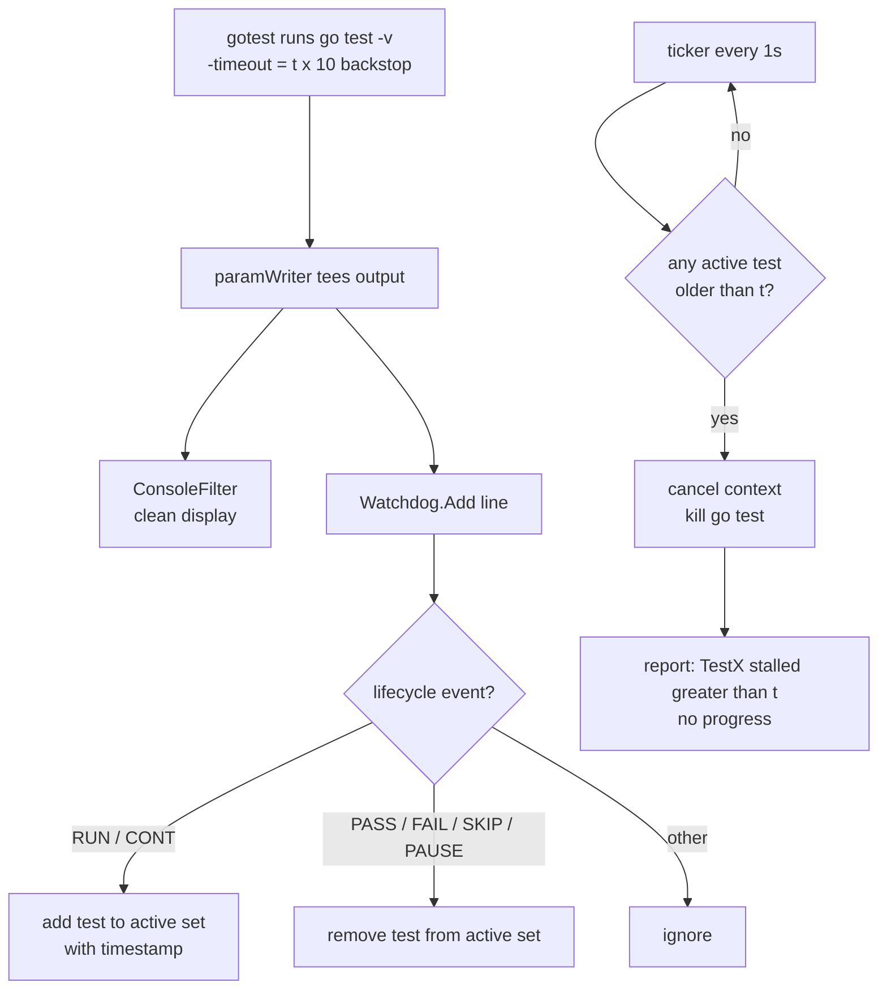

# gotest Watchdog Flow

Per-test stall detection replacing the per-package timeout budget. See [GOTEST_TIMEOUT_PLAN.md](../GOTEST_TIMEOUT_PLAN.md).

```mermaid
flowchart TD
    A[gotest runs go test -v<br/>-timeout = t x 10 backstop] --> B[paramWriter tees output]
    B --> C[ConsoleFilter<br/>clean display]
    B --> D[Watchdog.Add line]
    D --> E{lifecycle event?}
    E -->|RUN / CONT| F[add test to active set<br/>with timestamp]
    E -->|PASS / FAIL / SKIP / PAUSE| G[remove test from active set]
    E -->|other| H[ignore]
    I[ticker every 1s] --> J{any active test<br/>older than t?}
    J -->|no| I
    J -->|yes| K[cancel context<br/>kill go test]
    K --> L[report: TestX stalled greater than t<br/>no progress]
```
