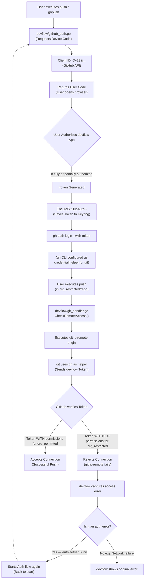

# GitHub Authorization Flow in Devflow

This diagram illustrates how the `devflow` authentication system affects Git operations and why access errors occur in repositories belonging to unauthorized organizations, and how the auto-recovery loop handles them.

## Problem Analysis

The problem lies in the fact that the OAuth token obtained via `github_auth.go` (Device Flow) is used globally through the `gh` CLI (which acts as a `credential.helper` for git).
When the user authorizes the `devflow` OAuth application in the browser, it is very likely that explicit access to the corresponding organization has not been granted (often because it requires administrator approval).

Since `git` uses this token for any HTTPS/SSH operation towards GitHub, executing `git ls-remote origin` in a repository where the organization has not granted permissions results in GitHub denying access.

## Implementation

The auto-recovery is implemented via Dependency Injection in `git_handler.go`:

1. **`Git` struct** holds an optional `authRetrier GitHubAuthenticator` field.
2. **`SetAuthRetrier(a GitHubAuthenticator)`** is called by `cmd/push` and `cmd/gopush` at startup, injecting `NewGitHubAuth()`.
3. **`CheckRemoteAccess()`** — on detecting `"Authentication failed"` or `"Could not read from remote repository"`:
   - Calls `authRetrier.EnsureGitHubAuth()` (triggers Device Flow — browser opens).
   - Retries `git ls-remote origin` once.
   - If retry succeeds → continues push transparently.
   - If retry fails → returns the raw error without noise.

During re-authentication, the terminal shows: `🔑 Access denied. Restarting authentication...` followed by the Device Flow prompt, guiding the developer to approve organization access in the browser before continuing.
