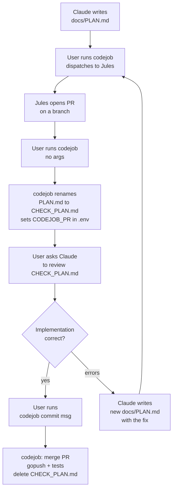
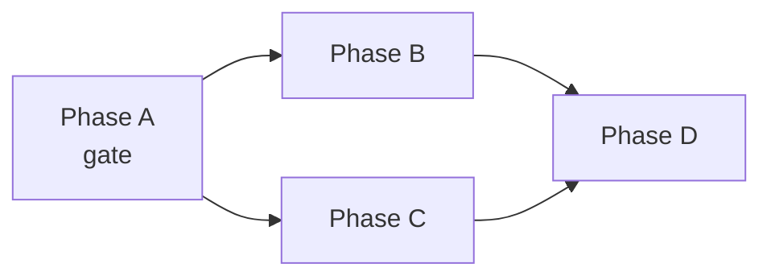

# CodeJob Agent Workflow

## Claude's Role in This Workflow

Claude acts **only as a planning and documentation agent**:

- Only edits `.md` files. Never executes code, shell commands, or compilers unless the user explicitly requests it.
- Never renames, moves, or deletes `PLAN.md` or `CHECK_PLAN.md`. The lifecycle of those files is managed automatically by `codejob`.
- Never applies a code fix directly when it affects more than 1 file: write a new `PLAN.md` and let codejob dispatch it.

## When to Create `PLAN.md` vs Edit Directly

- **Edit `.md` files directly** (SKILL.md, README.md, ARCHITECTURE.md, etc.) — documentation changes need no plan.
- **Create `docs/PLAN.md`** whenever the task involves modifying or creating Go code. The user reviews it before dispatching.
- `docs/PLAN.md` is ALWAYS at the **module root level** (next to `go.mod`), never inside sub-packages.

## Planning Process (Q&A First)

The planning agent MUST perform a conversational Q&A with the user before writing any `PLAN.md`:

1. Read the relevant code before asking — do not ask questions the code already answers.
2. Offer options with justification and wait for user decisions on every architectural choice.
3. Only write `docs/PLAN.md` once all decisions are resolved.

**The Q&A stays in chat. `PLAN.md` contains only final resolutions.**

## Plan Lifecycle



### Key rules for Claude when reviewing `CHECK_PLAN.md`

`CHECK_PLAN.md` is the **original `PLAN.md` renamed automatically by `codejob`** after Jules opens a PR. It is the spec of what was supposed to be implemented.

When the user asks Claude to review a `CHECK_PLAN.md`:

1. **Read `CHECK_PLAN.md`** to understand what was planned (stages, expected outputs, criteria).
2. **Inspect the actual code** in the repo to verify each stage was executed correctly.
3. **Verify documentation** — this is mandatory, agents frequently skip it:
   - `docs/API.md` updated if public API changed (new functions, types, signatures).
   - `docs/ARCHITECTURE.md` updated if design or structure changed.
   - `README.md` updated if usage examples or install instructions are affected.
   - `docs/SKILL.md` updated if the library's usage conventions changed.
   - Any doc explicitly listed as a deliverable in `CHECK_PLAN.md` must exist and be accurate.
   - If documentation is missing or stale → write a new `docs/PLAN.md` with only the doc fixes.
4. **Run or instruct tests** if needed (`gotest ./...`).
5. **If everything is correct (code + docs):** tell the user to run `codejob 'commit message'` to close the loop.
6. **If something is missing or broken:** write a new `docs/PLAN.md` with the specific fix. Do NOT edit code directly.

Claude **never**:
- Renames, moves, or deletes `PLAN.md` or `CHECK_PLAN.md` — managed by `codejob`.
- Runs `gopush` directly — `codejob` calls it internally.
- Applies multi-file code fixes directly — always via a new `PLAN.md`.

Claude **runs `codejob` when the user says "despacha"** (dispatch). This sends `docs/PLAN.md` to the Jules agent:

```bash
codejob   # dispatches docs/PLAN.md to Jules
```

The `codejob 'commit message'` form (close loop / publish) is always a **user action** — Claude never runs it.

```bash
codejob 'commit message'    # user only: merge PR + gopush + delete CHECK_PLAN.md
codejob 'commit msg' v0.2.0 # user only: same with explicit tag
```

## Error Handling After Agent Execution

When `gotest` fails or the agent reports errors:

| Scenario | Claude's action |
|---|---|
| Error in 1 file | Write new `PLAN.md` with the exact fix (include code) |
| Error in 2+ files | Write new self-contained `PLAN.md` with all changes |
| Design logic error | Q&A with user → new `PLAN.md` with resolved decision |

In all cases: Claude **does not execute** the fix directly. It only writes the `PLAN.md`.

## `PLAN.md` Rules

- Acts as the entry point for an **external agent with zero context** about this project.
- Must be fully self-contained: include all relevant constraints, interfaces, conventions, and examples inline.
- Link to relevant docs (`README.md`, `ARCHITECTURE.md`) but repeat critical rules inline — do not assume the agent will read them.
- Structure into clear, sequential execution steps with a stages table at the end.
- Never include `gopush` or `codejob` inside the plan — both are local developer tools managed outside the agent. `codejob` calls `gopush` internally when closing the loop; the agent must not call either.
- Every `PLAN.md` MUST include a header line referencing the workflow skill, so the agent understands the context it operates in. Example:
  ```
  > This plan is dispatched via the CodeJob workflow. See skill: agents-workflow.
  ```

## Code Quality Checklist (include inline in every code PLAN)

Every `PLAN.md` that touches Go code MUST state these constraints explicitly. Agents have zero context — if a rule is not in the plan, it will be violated.

### No hardcoded strings — typed constants only

```
RULE: Every repeated string (env key, file path, prefix, flag name, URL) MUST be
a named constant in the library package. String literals are forbidden in logic.
```

- Env var names → exported constants: `const EnvKeyFoo = "FOO"`
- File paths → exported constants: `const DefaultXPath = "docs/X.md"`
- Result/output prefixes → exported constants shared between producer and consumer
- Help flag lists → a single `var helpFlags = []string{...}` — never duplicated
- CLI help text that references paths/names → use `fmt.Sprintf` with constants, not literals

### Thin `cmd/` — all logic belongs in the library

```
RULE: cmd/*/main.go contains ONLY: argument parsing, dependency injection, and print/exit.
      Every conditional, validation, or environment check is an exported library function.
```

- ✅ `devflow.IsEnvironmentValid(dotenvPath)` — exported, testable
- ❌ `func isEnvironmentValid() bool { ... }` inside `cmd/` — untestable, unreachable from tests
- If the function reads env vars, accesses files, or makes decisions → it belongs in the library

### No logic duplication between library and cmd

- If the library already computes a value (e.g. a result prefix), `cmd/` uses the exported constant — never re-derives it inline.
- If `cmd/` re-implements a check the library already does, move it to the library and call it from both.

## MASTER_PLAN.md for Multi-Library Changes

When a breaking change affects multiple repositories in the monorepo:

- Create `docs/MASTER_PLAN.md` at the monorepo root as the orchestrator.
- Each affected library has its own self-contained `docs/PLAN.md`.
- `MASTER_PLAN.md` defines the dependency graph: what can run in parallel and what must wait.



- Mark explicitly which phases are **gates** (block the next ones) and which are **parallel**.

## Modular Stage Files

For complex features, use `PLAN.md` as a master checklist and break tasks into numbered stage files:

```
docs/
├── PLAN.md                    # Master orchestrator — index + checklist
├── PLAN_STAGE_1_MODELS.md     # Stage 1: data structures
├── PLAN_STAGE_2_CORE.md       # Stage 2: core logic
└── PLAN_STAGE_3_TESTS.md      # Stage 3: tests
```

Each stage file MUST include navigation at the top:
```
← [Stage 1](PLAN_STAGE_1_MODELS.md) | Next → [Stage 3](PLAN_STAGE_3_TESTS.md)
```

## Legacy Reference Code

When porting established logic, append snippets of the original code at the bottom of the relevant stage file. Explicitly tell the agent which logic to recycle and which dependencies to replace.

## TinyWasm-Specific Rules

Apply to all plans within the `tinywasm/*` ecosystem:

- **No standard library** in WASM-compiled packages: use `tinywasm/fmt` instead of `errors`, `strconv`, `strings`.
- **Value embedding only**: embed `dom.Element` as a value, never as a pointer (`*dom.Element`). Pointer embeds cause double heap allocation and GC pressure in TinyGo.
- **SSR split by extension**: CSS, SVG, JS, and heavy HTML strings MUST live in extension-named files with `//go:build !wasm`: `css.go` (RootCSS/RenderCSS), `js.go` (RenderJS), `html.go` (RenderHTML), `svg.go` (IconSvg). Never in `ssr.go` (convention eliminated). These files must never reach the WASM binary.
- **No `front.go`**: WASM interactivity goes in the main component file via `OnMount()`. TinyGo eliminates it as dead code on SSR builds.
- **`docs/PLAN.md` at module root**: always next to `go.mod`, never inside sub-packages.
