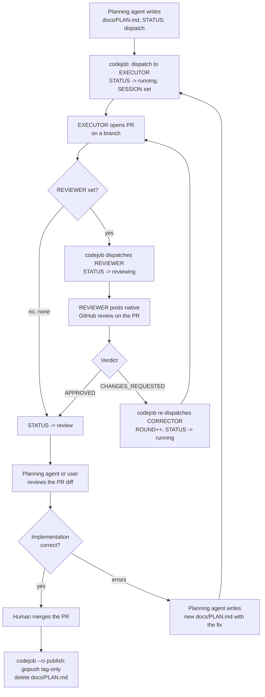

# CodeJob Agent Workflow

> How to write the actual content of a `PLAN.md` (structure, precision level,
> quality checklist, TinyWasm-specific rules) is a separate domain: see skill
> **plan-authoring**. This skill covers the process around it — when to
> create one, the Q&A gate, dispatch, review, and local execution.

## The Planning Agent's Role in This Workflow

The agent reading this skill (Claude, Gemini, or any other installed LLM) acts **only as a planning and documentation agent**:

- Only edits `.md` files. Never executes code, shell commands, or compilers unless the user explicitly requests it.
- Never renames, moves, or deletes `docs/PLAN.md`. Its lifecycle (dispatch → running → reviewing → review → published+deleted) is managed automatically by `codejob`, driven entirely by the `STATUS` key in its own frontmatter — there is no `.env` state and no `CHECK_PLAN.md` anymore. **Single exception:** when the user decides a plan runs LOCALLY, it is renamed to `docs/LAST_PLAN_EXECUTED.md` — see "Local Execution Flow" below.
- Never applies a code fix directly when it affects more than 1 file: write a new `PLAN.md` and let codejob dispatch it.

## When to Create `PLAN.md` vs Edit Directly

- **Edit `.md` files directly** (SKILL.md, README.md, ARCHITECTURE.md, etc.) — documentation changes need no plan.
- **Create `docs/PLAN.md`** whenever the task involves modifying or creating Go code. The user reviews it before dispatching. Content rules: skill **plan-authoring**.
- `docs/PLAN.md` is ALWAYS at the **module root level** (next to `go.mod`), never inside sub-packages.
- `docs/PLAN.md` MUST **open** with a frontmatter block — first line of the file is `---`, before any heading — or `codejob` refuses to dispatch it:

  ```markdown
  ---
  PLAN: "feat: what this plan implements"
  TAG: v0.2.0
  EXECUTOR: jules
  REVIEWER: none
  ---
  ```

  `PLAN` is required (the commit message used when closing the loop); everything
  else is optional. `STATUS`, `SESSION`, `REVIEW_SESSION`, `ROUND` and `PR` are
  **machine-written** — `codejob` updates them as the plan moves through its
  state machine; the planning agent never sets them by hand. Full key reference
  and details: skill **plan-authoring**.

### Never clobber an existing plan — `PLAN.md` becomes an execution queue

Before writing `docs/PLAN.md`, check whether one already exists with a pending plan:

1. **Existing plan found** → copy its full content to a descriptive file: `docs/PLAN_<TOPIC>.md` (topic in SCREAMING_SNAKE, e.g. `PLAN_KIND_UNIFICATION_INPUTSCHEMA.md`).
2. Write the new plan to its own `docs/PLAN_<NEW_TOPIC>.md`.
3. Rewrite `docs/PLAN.md` as an **execution queue**. The dispatch message the agent receives is always *"execute the plan described in docs/PLAN.md"*, so the queue MUST open with an explicit instruction that resolves that message to all of them:

   ```markdown
   # PLAN — execution queue for `<module>`

   > If you were told to "execute the plan described in docs/PLAN.md", execute
   > **ALL the plans below, in order (top to bottom)**. Each plan is
   > self-contained; finish one (its acceptance criteria green) before starting
   > the next. Never mix changes from one plan into another.

   | Order | Plan | Subject |
   |-------|------|---------|
   | 1 | [PLAN_<TOPIC>.md](PLAN_<TOPIC>.md) | ... |

   After completing all plans, run `gotest ./...` one final time: everything green.
   ```

4. **No existing plan** → write the plan directly in `docs/PLAN.md` (single-topic case; it stays dispatchable by `codejob` as-is).

### Local Execution Flow — `LAST_PLAN_EXECUTED.md`

Not every plan is dispatched. When the user decides an existing `docs/PLAN.md`
will be executed **locally** (immediately, in-session, instead of via codejob):

1. **Rename `docs/PLAN.md` → `docs/LAST_PLAN_EXECUTED.md` at that moment.**
   This frees `docs/PLAN.md` (no clash with codejob's rename/delete lifecycle
   or with other plans queued later) and marks the plan as locally owned.
2. Execute the work with `LAST_PLAN_EXECUTED.md` as the spec.
3. It is **committed together with its implementation on `gopush`** (the only
   publish path) — the executed spec lands in git history next to the code it
   produced.
4. On the NEXT local execution in the same repo: **overwrite the content** of
   the existing `docs/LAST_PLAN_EXECUTED.md` with the new plan — never create
   numbered variants (`LAST_PLAN_EXECUTED_2.md`). Git history preserves every
   previous version, so the repo keeps a detailed, commit-anchored record of
   what was done and when.
5. Its content ROTATES: other documents may point to it only as "the most
   recent locally executed plan" — never cite its sections or rely on
   specific content (same staleness rule as `PLAN.md` references).

### Master plan naming — never overwrite `MASTER_PLAN.md`

Multi-repo orchestrators at the monorepo root use a **descriptive name consistent with the task**: `docs/<TOPIC>_MASTER_PLAN.md` (e.g. `SIZE_OPTIMIZATION_MASTER_PLAN.md`, `MCP_DAEMON_HARDENING_MASTER_PLAN.md`). A bare `docs/MASTER_PLAN.md` likely already exists from a previous wave — never overwrite or reuse it for a new topic.

## Planning Process (Q&A First)

The planning agent MUST perform a conversational Q&A with the user before writing any `PLAN.md`:

1. Read the relevant code before asking — do not ask questions the code already answers.
2. **Investigate prior art before proposing a mechanism**: the repo's git history, predecessor repos (pre-split origins), and settled decision records (ARCHITECTURE/DESIGN). When a decision record rejects an approach, verify its scope — it may have rejected a *different variant* than the one under consideration (e.g. "never execute the user's package" does not cover executing dependency packages).
3. **Never present a single take-it-or-leave-it proposal for an architectural choice.** Offer at least two candidate approaches with honest trade-offs and a recommendation, and wait for the user's decision. Writing a plan around an un-offered choice invalidates the plan.
4. Only write `docs/PLAN.md` once all decisions are resolved.

**The Q&A stays in chat. `PLAN.md` contains only final resolutions.**

## Plans Are Ephemeral — Rationale Lives in Permanent Docs

`docs/PLAN.md` is deleted by `codejob` the moment a human merges the PR (the
merge is what publishes). There is no intermediate rename anymore — the same
file goes `dispatch → running → reviewing → review → deleted`, all via its own
`STATUS` frontmatter key. Consequences:

- Anything that must outlive execution — decision rationale, rejected alternatives, contracts — goes to **permanent docs** (`ARCHITECTURE.md`, `DESIGN.md`) **before dispatch** (documentation-first). The plan's documentation stage then says **VERIFY the docs against the implementation**, never "create" them.
- **Permanent docs (README, ARCHITECTURE, DESIGN, SPECS, diagrams) must NEVER link to or cite `docs/PLAN.md`**, including section references like "PLAN §8" — they are guaranteed dead references once the plan is published and deleted. If a doc written ahead of implementation needs an interim marker, use a self-deleting note — `STATUS (remove this note when X lands): …` — and make its removal an explicit task in the plan. Note the plan's `STATUS` frontmatter key is unrelated to this convention — don't confuse the two.

## Plan Lifecycle

`STATUS` in `docs/PLAN.md`'s own frontmatter is the single source of truth —
every transition below is a git commit, so the loop runs identically locally or
in GitHub Actions (see skill **plan-authoring** for the full key reference).



### Key rules for the planning agent when reviewing an open PR

There is no `CHECK_PLAN.md` anymore. While a plan is in flight, `docs/PLAN.md`
stays under that exact name — only its `STATUS` frontmatter changes — so the
spec of what was supposed to be implemented is the same file, read from the PR
branch (`gh pr checkout <n>` or `gh pr diff <n>`).

When the user asks the planning agent to review a plan's PR (`STATUS: review`,
or `reviewing` if a `REVIEWER` already ran):

1. **Read `docs/PLAN.md` on the PR branch** to understand what was planned (stages, expected outputs, criteria).
2. **Inspect the actual code** in the diff to verify each stage was executed correctly.
3. **Verify documentation** — this is mandatory, agents frequently skip it:
   - `docs/API.md` updated if public API changed (new functions, types, signatures).
   - `docs/ARCHITECTURE.md` updated if design or structure changed.
   - `README.md` updated if usage examples or install instructions are affected.
   - `docs/SKILL.md` updated if the library's usage conventions changed.
   - Any doc explicitly listed as a deliverable in the plan must exist and be accurate.
   - If documentation is missing or stale → write a new `docs/PLAN.md` with only the doc fixes.
4. **Run or instruct tests** if needed (`gotest ./...`).
5. **If everything is correct (code + docs):** tell the user to merge the PR (cloud) — the merge itself publishes — or run `codejob 'commit message'` locally to merge + `gopush` + delete `docs/PLAN.md` in one step.
6. **If something is missing or broken:** write a new `docs/PLAN.md` with the specific fix (on `main`, once the broken PR's branch is abandoned or corrected via the `REVIEWER`/`CORRECTOR` round). Do NOT edit code directly.

The planning agent **never**:
- Renames, moves, or deletes `docs/PLAN.md`, or edits its machine-owned frontmatter keys (`STATUS`, `SESSION`, `REVIEW_SESSION`, `ROUND`, `PR`) — all managed by `codejob` (sole exception: the rename to `LAST_PLAN_EXECUTED.md` when the user opts for local execution — see "Local Execution Flow").
- Merges the PR or runs `gopush` **to close a dispatched plan's loop** — that's the human's call (cloud) or `codejob 'msg'` (local), which calls `gopush` internally. (Outside a plan loop, `gopush` is the normal publish path — see below.)
- Applies multi-file code fixes directly — always via a new `PLAN.md`.

## Publishing: `gopush` vs `codejob` — do not confuse them

They are not alternatives. **`gopush` publishes. `codejob` runs the plan loop**
(dispatch → running → reviewing → review → close) driven by `STATUS` in
`docs/PLAN.md`'s own frontmatter, and *calls `gopush` for you* at the end.

| You did… | Publish with | Why |
|---|---|---|
| Edited docs / a 1-file code fix, **no plan** | **`gopush 'message'`** | There is no plan and no PR. Nothing for `codejob` to close. |
| Wrote `docs/PLAN.md` and dispatched it | **`codejob 'message'`** (local) or **merge the PR** (cloud) | Closes the loop: merges the PR, calls `gopush`, deletes `docs/PLAN.md`. |
| Ran a plan **locally** (`LAST_PLAN_EXECUTED.md`) | **`gopush 'message'`** | No PR was ever opened; the executed spec is committed alongside the code. |

⚠️ **Never run bare `codejob` to "check something".** With no arguments it
**advances the state machine one step** — dispatches to the `EXECUTOR` if
`STATUS: dispatch`, dispatches the `REVIEWER` or merges/publishes if further
along — it is not a lint, a dry-run, or a way to inspect an error. To validate
a plan's frontmatter, read the file. (`--ci <phase>` is the same state machine
invoked non-interactively by the GitHub Action; the planning agent never calls
`--ci` by hand.)

The planning agent **runs `codejob` when the user says "despacha"** (dispatch). With a fresh `docs/PLAN.md` (`STATUS: dispatch` or no `STATUS` at all) this sends it to the execution agent (Jules):

```bash
codejob   # STATUS: dispatch -> running; sends docs/PLAN.md to the EXECUTOR
```

The `codejob 'commit message'` form (close loop / publish, **local only**) can be run by **the planning agent or the user** once `STATUS: review`:

```bash
codejob 'commit message'        # merge PR + gopush + delete docs/PLAN.md
codejob 'commit msg' v0.2.0     # same with explicit tag
```

In the **cloud** setup (`codejob --init-action`), there is no local close step:
the human merges the PR from web/mobile, and that merge itself triggers
`codejob --ci publish` in the Action.

## Error Handling After Agent Execution

When `gotest` fails or the agent reports errors:

| Scenario | Planning agent's action |
|---|---|
| Error in 1 file | Write new `PLAN.md` with the exact fix (include code) |
| Error in 2+ files | Write new self-contained `PLAN.md` with all changes |
| Design logic error | Q&A with user → new `PLAN.md` with resolved decision |

In all cases: the planning agent **does not execute** the fix directly. It only writes the `PLAN.md`.
