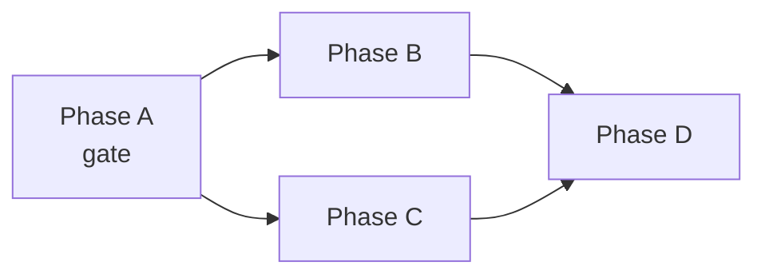

# Plan Authoring

> Process around `PLAN.md` (when to create one, Q&A gate, dispatch, review,
> local execution) is a separate domain: see skill **agents-workflow**. This
> skill covers what the document itself must contain.

## Frontmatter — REQUIRED, or dispatch fails

Every `docs/PLAN.md` MUST **open** with a frontmatter block. The very first line of the file
is `---`, **before** any heading or blockquote. All state for the plan's loop
lives here — there is no `.env` and no `CHECK_PLAN.md`; every phase transition
is a git commit to this same block, so the loop runs identically locally or in
GitHub Actions:

```markdown
---
PLAN: "feat: what this plan implements"
TAG: v0.2.0
EXECUTOR: jules
REVIEWER: none
---

> This plan is dispatched via the CodeJob workflow. See skill: agents-workflow.

# Plan — ...
```

| Key | Who writes it | Required | Meaning |
|---|---|---|---|
| `PLAN` | human/planning agent | **yes** | Commit message used when the loop closes (`codejob 'msg'` overrides it). |
| `TAG` | human/planning agent | no | Explicit version (`v0.2.0`); omitted → `gopush` auto-bumps. |
| `EXECUTOR` | human/planning agent | no | Agent that implements the plan and opens the PR (default `jules`). |
| `REVIEWER` | human/planning agent | no | Agent that judges the PR and posts a native GitHub review (`APPROVED`/`CHANGES_REQUESTED`); `none`/absent → human-only review, no reviewer dispatch. |
| `CORRECTOR` | human/planning agent | no | Agent that applies review feedback (default: the `EXECUTOR`). |
| `REVIEW_GUIDE` | human/planning agent | no | Path to extra review criteria (e.g. `docs/REVIEW.md`). |
| `STATUS` | **machine only** | — | `dispatch` → `running` → `reviewing` → `review`. Absent/`dispatch` means "pending dispatch". |
| `SESSION` | **machine only** | — | Executor session id. |
| `REVIEW_SESSION` | **machine only** | — | Reviewer session id. |
| `ROUND` | **machine only** | — | Executor↔reviewer round count (capped, default 3; over cap hands to human review). |
| `PR` | **machine only** | — | URL of the PR opened by the executor. |

The planning agent (and the human) only ever set `PLAN`, `TAG`, `EXECUTOR`,
`REVIEWER`, `CORRECTOR`, `REVIEW_GUIDE` — the machine-only keys are written
exclusively by `codejob` as the plan moves through its state machine and must
never be hand-edited. Unknown keys are ignored. Full behavioral spec: see
`docs/CODEJOB.md` and `docs/diagrams/CODEJOB_FLOW.md` in the `devflow` repo.

Without the opening `---`, `codejob` aborts with `plan frontmatter: file must start with a '---' line`.

## `PLAN.md` Rules

- Acts as the entry point for an **external agent with zero context** about this project.
- Must be fully self-contained: include all relevant constraints, interfaces, conventions, and examples inline.
- Link to relevant docs (`README.md`, `ARCHITECTURE.md`) but repeat critical rules inline — do not assume the agent will read them.
- **Cross-repo references MUST be GitHub web URLs** (e.g. `https://github.com/tinywasm/<repo>/blob/main/docs/X.md`), never local relative paths (`../../other-repo/...`) — the executing agent only has the repo being dispatched. In-repo relative links are fine. Either way the critical content is restated inline; external links are optional reading.
- Structure into clear, sequential execution steps with a stages table at the end.
- Never include `gopush` or `codejob` inside the plan — both are local developer tools managed outside the agent. `codejob` calls `gopush` internally when closing the loop; the agent must not call either.
- Every `PLAN.md` MUST include a header line referencing the workflow skill, so the agent understands the context it operates in. Example:
  ```
  > This plan is dispatched via the CodeJob workflow. See skill: agents-workflow.
  ```

## Write for a less-capable executor

The litmus test: **the executing agent must need zero design judgment** — every decision is already made in the plan. If a choice is still open, that is a Q&A gap, not a detail to delegate. Concretely:

- **Name exact files per stage**, including new files to create (`storage.go`, `probe.go`) — never "a new resolution unit".
- **Quote error messages verbatim** in backticks; the agent copies them into typed constants.
- **List every deletion explicitly** (functions, fields, fallbacks) and back each with a grep-verifiable acceptance criterion (`grep -rn "parseFieldType" .` → empty). A weak agent will not remove code the plan didn't order removed — silent legacy fallbacks survive and coexist with the new path.
- **State anti-footguns where an ecosystem rule could be misapplied to this repo.** Example: "no stdlib in WASM-shared code" next to a backend-only tool must say "this repo is backend tooling and legitimately uses stdlib — do NOT 'fix' those imports", or a literal-minded agent will purge valid code.
- **Risky mechanics need a specified fallback and a test seam**: any toolchain execution or environment-dependent behavior states what to do when it fails (e.g. probe file rejected outside the module tree → write it under a throwaway subdir of the module root) and requires an injectable runner so unit tests need no real toolchain.
- **Be type-precise in wording**: a cache key is a typed struct, not a "typed constant"; identify packages by import path resolved through the file's import block, never by literal selector text (aliases break text matching).

## Code Quality Checklist (include inline in every code PLAN)

Every `PLAN.md` that touches Go code MUST state these constraints explicitly. Agents have zero context — if a rule is not in the plan, it will be violated.

### No hardcoded strings — typed constants only

```
RULE: Every repeated string (env key, file path, prefix, flag name, URL) MUST be
a named constant in the library package. String literals are forbidden in logic.
```

- Env var names → exported constants: `const EnvKeyFoo = "FOO"`
- File paths → exported constants: `const DefaultXPath = "docs/X.md"`
- Result/output prefixes → exported constants shared between producer and consumer
- Help flag lists → a single `var helpFlags = []string{...}` — never duplicated
- CLI help text that references paths/names → use `fmt.Sprintf` with constants, not literals

### Thin `cmd/` — all logic belongs in the library

```
RULE: cmd/*/main.go contains ONLY: argument parsing, dependency injection, and print/exit.
      Every conditional, validation, or environment check is an exported library function.
```

- ✅ `devflow.IsEnvironmentValid(dotenvPath)` — exported, testable
- ❌ `func isEnvironmentValid() bool { ... }` inside `cmd/` — untestable, unreachable from tests
- If the function reads env vars, accesses files, or makes decisions → it belongs in the library

### No logic duplication between library and cmd

- If the library already computes a value (e.g. a result prefix), `cmd/` uses the exported constant — never re-derives it inline.
- If `cmd/` re-implements a check the library already does, move it to the library and call it from both.

### Execution contract for AI-driven CLIs

```
RULE: Any cmd that may be run by an automation/LLM MUST be non-interactive by default,
      separate stdout (data) from stderr (logs), and use deterministic exit codes.
```

- **No args → print help to stdout, exit `0`.** Never block on a TUI/stdin by default; interactive modes go behind an explicit flag (e.g. `-tui`).
- **stdout = consumable data only; stderr = all logs/diagnostics** — use `fmt.Fprintln(os.Stderr, …)` for anything diagnostic so a caller capturing stdout gets clean output.
- **Exit `0` on success/help/clean shutdown; non-zero on bad flags or startup failure.** Library returns errors; thin `main` maps them to codes.
- **Rich results go through the protocol surface** (MCP/JSON-RPC tools), not free-form stdout.
- Full rationale: see skill **core-principles → "AI-Consumable CLIs (Execution Contract)"**.

## Master plans for Multi-Library Changes

When a breaking change affects multiple repositories in the monorepo:

- Create `docs/<TOPIC>_MASTER_PLAN.md` at the monorepo root as the orchestrator (descriptive name — see skill **agents-workflow** → "Master plan naming"; never a bare `MASTER_PLAN.md`).
- Each affected library has its own self-contained `docs/PLAN.md` (or `docs/PLAN_<TOPIC>.md` queued in `PLAN.md` when the library already had a pending plan).
- The master plan defines the dependency graph: what can run in parallel and what must wait.



- Mark explicitly which phases are **gates** (block the next ones) and which are **parallel**.

## Modular Stage Files

For complex features, use `PLAN.md` as a master checklist and break tasks into numbered stage files:

```
docs/
├── PLAN.md                    # Master orchestrator — index + checklist
├── PLAN_STAGE_1_MODELS.md     # Stage 1: data structures
├── PLAN_STAGE_2_CORE.md       # Stage 2: core logic
└── PLAN_STAGE_3_TESTS.md      # Stage 3: tests
```

Each stage file MUST include navigation at the top:
```
← [Stage 1](PLAN_STAGE_1_MODELS.md) | Next → [Stage 3](PLAN_STAGE_3_TESTS.md)
```

## Legacy Reference Code

When porting established logic, append snippets of the original code at the bottom of the relevant stage file. Explicitly tell the agent which logic to recycle and which dependencies to replace.

## TinyWasm-Specific Rules

Apply to all plans within the `tinywasm/*` ecosystem:

- **No standard library** in WASM-compiled packages: use `tinywasm/fmt` instead of `errors`, `strconv`, `strings`.
- **Value embedding only**: embed `dom.Element` as a value, never as a pointer (`*dom.Element`). Pointer embeds cause double heap allocation and GC pressure in TinyGo.
- **SSR split by extension**: CSS, SVG, JS, and heavy HTML strings MUST live in extension-named files with `//go:build !wasm`: `css.go` (RootCSS/RenderCSS), `js.go` (RenderJS), `html.go` (RenderHTML), `svg.go` (IconSvg). Never in `ssr.go` (convention eliminated). These files must never reach the WASM binary.
- **No `front.go`**: WASM interactivity goes in the main component file via `OnMount()`. TinyGo eliminates it as dead code on SSR builds.
- **`docs/PLAN.md` at module root**: always next to `go.mod`, never inside sub-packages.
